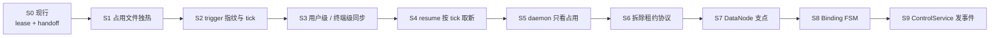

# dual-tmux ROADMAP

> v0.4.59：S7–S8。freeze 在 working copy 上证明，经 TunnelNode 投影后才提交；ControlService.freeze 校验节点。Resume FSM 仍是 shadow。
> CLI 表面能力不阉割：`new / enter / work / freeze / resume / drop / ls / pull / push` 仍可用。
> 本路线图的权威设计见 [docs/core-architecture.md](docs/core-architecture.md)。

## 现在 vs 目标

现行实现把独热做成了分布式写者共识：4 秒 Lease、generation、handoff persist→park→commit、过期后 fenced fault takeover。实测故障是 **Lease 续租 ≠ 旧端能交接**，新端只能空等 10 秒 fail-closed。

目标只做三件事：

1. 记住 DST（两端 agent 会话对），方便跨重启、跨机器续接。
2. 服务模式下按 `USER/MACHINE` 备份 trigger 现场；bullet 留在项目端点，不拷会话。
3. 独热：`resume` 声明占用，其他端 daemon 退出本地 tmux，回到 shell。

## S1 占用文件独热（已落地）

结构：Hub 增加无 TTL 的 `occupancy/<dt-name>.json`，内容是当前 `USER/MACHINE`（即 `client`）。`resume` 覆盖写入即声明；不请求 handoff，不等旧端 persist。

功能：其他端 daemon / `dt tick` 读到占用者不是自己，立刻 `drop` 本机这条隧道的 tmux（`op_*` 以及本机 SSH 窗 `run_*`），回到 shell。不杀远端容器里的 bullet agent。Hub 不可达、锁屏、睡眠不得清退。

体验：新端 `dt resume` 在数秒内进入工作；旧端在线则马上退出，离线则醒来再退。为兼容未升级 Client，占用写入时仍顺带覆盖旧 lock 并升高 generation，让旧 watchdog 也能退。

## S2 trigger 指纹与 tick（已落地）

结构：指纹只算 trigger pane 最近 20 行（去 ANSI、SHA-1）。tick 日志放在对应 `op_*` 目录，随 MACHINE 走，不再把全局 `activity.log` 当权威。bullet pane 不算指纹。

功能：指纹相对该 MACHINE 最新一条没变，就不追加 tick。`resume` / `pull` 用「最后一次指纹变化」比较哪台 MACHINE 的 trigger 更新。

体验：空闲机器每分钟 rsync 不会把自己刷成「更新」。

## S3 两层同步（已落地）

结构：

- 用户级：`tunnels/`、`entries/`、DST 绑定。任一端变更立即 rsync。
- 终端级：`~/<user>/sessions/.../<tm_*>/`，每分钟 rsync trigger 快照与 tick。
- bullet 会话不同步；远端 sqlite 是唯一真相。

功能：`freeze` 是普通命令，用户或 trigger agent 都可发。覆盖当前 DST；另存新 DST 走 `branch`。freeze 只记录此刻已绑定的 session id，不猜最新会话。

体验：管理信息和 trigger 现场分离。bullet 位置变了，freeze 覆盖端点即可。

## S4 resume 按 tick 取新（已落地）

结构：`resume` / `pull` 先拉用户级 DST，再按 tick 选较新 MACHINE 的 trigger 快照，导入当前机器，再写占用。

功能：不在 resume 路径做 snapshot union 猜主线。冲突仍 fail-closed 并备份。bullet 只重连绑定的端点与 session id。

体验：从 MACHINE1 工作后到 MACHINE2：`dt pull`（或 resume 内置拉取）→ 占用 → 看到同一 trigger 会话。

## S5 daemon 收敛（已落地）

结构：daemon 不再跑 Lease worker、handoff persist 线程。只做：读占用、该退就退、占用者心跳刷新 lock 时间戳、可选 Feishu mailbox。

功能：独立模式 daemon 不参与独热。服务模式不把「进程活着」当成「能交接」。

体验：锁屏/睡眠只是本机暂停；不会因为 4 秒 TTL 把自己踢掉。

## S6 拆除租约协议（热路径已拆，Hub 脚本已删）

结构：occupancy JSON 是独热权威。Hub 上 tunnel 的 handoff v2 / fault takeover / lease sidecar 已删除。`_lock_remote` 只留给飞书 connector。DataNode 业务节点不变，运行层是 OccupancyNode + pane 观察。

功能：CLI 动词不变。Web/飞书仍调同一套 ControlService，内部改为占用而不是租约。

体验：用户无感，故障面变小。

## S7 节点成为领域支点（freeze 提交已走 TunnelNode）

结构：Tunnel 拥有 RoleBinding；Session 不再携带 role。Occupancy 是独热事实。Client 是 `tm_*`。
不建 ClientInstallation，不把 Lease 做成节点生命周期。CLI dict 仍是磁盘格式；提交时 `from_legacy_tunnel` / `to_legacy_tunnel` 往返。

功能：freeze 证明阶段只改 working copy。Guard 通过后投影 TunnelNode，再写 run entry。原 tunnel dict 在 `bound` 前不变。

体验：freeze / rebuild 的目标是“提交一条 RoleBinding”，不是边探测边改 JSON。

## S8 BindingAttempt FSM（prove → node commit）

结构：freeze 与“trigger 重建 bullet”走同一 Graph。Guard / `on_enter` 无 I/O。worker 在 `live_session_proven` 与 `commit_succeeded` 之间执行 `apply_proven_binding`（TunnelNode 投影 + bullet `persist_run_entry`）。用户级 rsync 仍由 freeze 入口 `hub.push_best_effort` 负责。

功能：重建 bullet 后 endpoint / `runtime.cmd` / run entry 与新 session 一次对齐。entry 写失败则不改原 binding。

体验：用户或 trigger 发同一条 freeze 命令；失败 fail-closed，旧 DST 仍可用。

确认稿：[docs/datanode-fsm.md](docs/datanode-fsm.md)。

## S9 ControlService 发事件，入口保持薄（占用已对齐；Resume 仍 shadow）

结构：CLI / Web / 飞书只调用 ControlService。`freeze` 结束后校验 TunnelNode。真正改节点必须先 `Machine.send(live_session_proven)`。Resume 顺序不变：拉 DST → tick → 预检 → 占用 → 按 binding 恢复；ResumeAttempt 仍写 shadow，本版不升权威。

功能：现有 CLI 动词不减少。Web 面板继续占用语义。

体验：换机 `dt upgrade && dt pull && dt resume` 仍是日常路径。

## 不变量（全程）

- 独立模式零 SSH / 零占用。
- 不覆盖、不猜测 OpenCode session id。
- 远端 bullet agent 不是占用清退的对象。
- 现行 CLI 命令集不减少。
