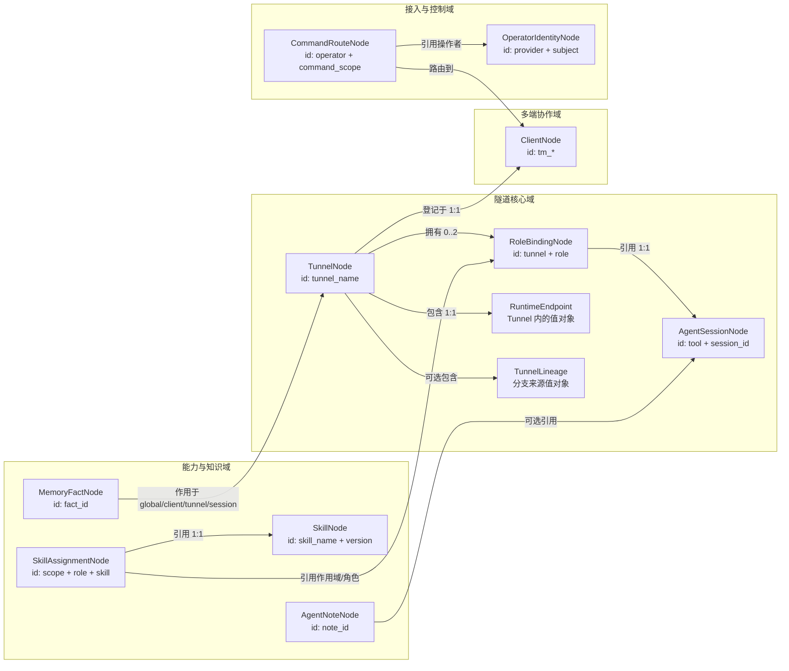
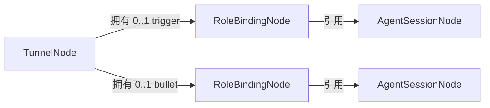

# dual-tmux 业务节点全景与演进建议

## 结论

当前 `datanode/models.py` 中的 `TunnelNode`、`AgentSessionNode` 和
`RuntimeEndpointNode`，只覆盖了 `dt new / freeze / resume / enter / work` 主链路的
第一组核心业务概念，不能视为 dual-tmux 的全部业务节点。

当前模型已完成两项结构调整：

1. 从 `AgentSessionNode` 中拆出 `RoleBindingNode`。Agent 会话是独立对象，trigger 和
   bullet 是它在某条 Tunnel 中承担的角色，不是 Session 的固有属性。
2. `RuntimeEndpoint` 是 `TunnelNode` 内部的值对象，没有独立生命周期。

Client 身份用 `ClientNode`（`tm_*`）表达。占用 holder 就是这个 id。不再引入
`ClientInstallationNode`：独热是 occupancy 后写覆盖，不靠 installation fence。

## 什么是业务节点

业务节点表示即使 tmux、daemon、SSH 和 Agent 进程全部停止，用户仍然希望系统记住
并继续使用的业务事实。它回答的是“dual-tmux 为用户形成了什么稳定结果”，而不是
“系统此刻如何运行”。

以下属于业务事实：

- 用户登记了一条什么 Tunnel；
- Tunnel 两端分别绑定了哪个可恢复的 Agent Session；
- Bullet 的稳定工作位置在哪里；
- 用户拥有哪些可识别的 Client（`tm_*`）；
- Trigger/Bullet 分配了哪些技能；
- 哪些长期事实、笔记、操作者身份和路由需要跨进程保留。

以下不属于业务事实：

- 当前 ownership holder 和 generation；
- tmux 是否 attached；
- 当前 Agent PID 和 writer 数量；
- SSH、Docker 或 WebSocket 此刻是否健康；
- daemon 的采样、重试和连接状态；
- snapshot 当前是否冲突。

这些是运行类节点或运行证据。

## 完整业务域候选



图中的“拥有”表示左端负责关系的建立和移除；“包含”表示右端没有独立生命周期；
“引用”表示两端有各自生命周期，只通过稳定 ID 建立关联。

## 隧道核心域

### `TunnelNode`

`TunnelNode` 是用户可操作的隧道聚合根，而不是 tunnel JSON 或一对正在运行的 tmux
进程。

建议保留的事实：

- `tunnel_name`：Hub 范围内唯一，格式为 `dt-*`；
- `op_tmux_name`：Trigger 的本地入口，格式为 `op_*`；
- `run_tmux_name`：Bullet 工作入口，格式为 `run_*`；
- `runtime_endpoint`：Bullet 的稳定工作位置值对象；
- `registered_client_id`、`user_id`：登记来源；
- `lineage`：可选的分支来源；
- Trigger/Bullet 的 binding 引用或由 Tunnel 拥有的 binding 集合。

核心不变量：

- op 和 run 身份必须不同且命名合法；
- 同一 Tunnel 的同一 role 最多有一个有效 binding；
- Trigger 和 Bullet 不得绑定同一个 Session；
- 普通未 freeze 的 DT 可以没有任何 binding，仍然是合法 Tunnel；
- tmux、SSH 或 Agent 进程停止不能删除或篡改 Tunnel 事实。

生命周期：

- `dt new` 创建；
- `dt branch` 创建新的 Tunnel，并记录 lineage；
- freeze/bind 修改角色绑定，不改变 Tunnel 身份；
- 只有显式 `dt rm` 删除；锁屏、断网、租约过期和 tmux 退出都不构成删除事件。

### `AgentSessionNode`

`AgentSessionNode` 表示 Agent 工具自身可恢复的会话，不表示当前运行进程，也不天然属于
Trigger 或 Bullet。

建议事实：

- `session_id` 与 `tool`：共同构成跨 Agent 工具安全的身份；
- `model`、`slug`、`agent`：Agent 原生会话属性；
- `native_directory`：Agent 会话保存的工作目录；
- 可选 `AgentClientMetadata`：创建或最近验证该会话的客户端信息。

Session 不应拥有：

- `role`：角色属于 binding；
- `frozen_at`：冻结发生在 Tunnel 与 Session 的绑定关系上；
- tmux name、PID、attached、writer count：这些属于运行观察；
- snapshot 文件内容：snapshot 是外部载体或独立运行节点。

生命周期：

- Agent 创建原生会话时建立；
- pane down 或 Tunnel 解绑后仍可存在；
- 只有原生会话被确认删除或不可恢复时失效；
- 一个 Session 是否允许被多个 Tunnel 引用，需要在后续明确产品规则，不能由存储偶然
  状态决定。

### `RoleBindingNode`

这是当前第一稿缺失的关键业务关系节点。它表达：

> 某条 Tunnel 的某个角色，绑定到哪个 Agent Session。

建议字段：

- 身份：`tunnel_name + role`；
- `session_ref`：`tool + session_id`；
- `role`：`trigger | bullet`；
- `parser`：这个角色的 pane 输出如何解释；
- `bound_at`、`frozen_at`：关系建立及最近形成可迁移快照的时间；
- `bound_by_client_id`：哪一端确认了绑定。

核心不变量：

- 同一 Tunnel 的同一 role 只能有一个当前 binding；
- binding 引用的 Session 必须存在或有可验证的恢复载体；
- 同一 Tunnel 的 Trigger/Bullet 不能引用同一 Session；
- 替换 binding 必须显式发生，不能因为一次 pane 探测失败自动换成“最新 Session”；
- branch 是否复制 Session 或建立新 Session，必须作为明确领域操作处理。

拆分后的关系是：



### `RuntimeEndpoint`

Endpoint 回答“Bullet 恢复时应该到哪里工作”，不回答 SSH 或 Docker 此刻是否健康。

建议继续使用判别联合：

- `LocalEndpoint(directory)`；
- `SshEndpoint(server, port, directory)`；
- `DockerEndpoint(server, port, container, directory)`。

它是 Tunnel 内的值对象，原因是：

- 没有独立于 Tunnel 的创建和删除操作；
- 用户修改的是“这条 Tunnel 的工作位置”；
- 不需要被多个聚合共享引用；
- identity 和 reconnect command 都可以从位置字段派生。

`runtime.cmd` 不应继续作为权威事实。正确关系是：

```text
server + port + container + directory
                    │
                    └──派生──> reconnect_command
```

这样修改 endpoint 后不会遗留一条过期的重连命令。

### `TunnelLineage`

当前的 `branched_from` 可以先建成 Tunnel 内的值对象，而不必提升成独立节点。它应至少
说明来源 Tunnel；如果未来 branch 需要审计复制了哪些 binding、在哪个时间点派生，才
考虑提升为拥有独立身份的关系节点。

## 多端协作域

### `ClientNode`

`ClientNode` 是用户能识别和命名的操作端，例如 `tm_ouc`、`tm_andy_home`。它不是一次
daemon 进程，也不是某次 ownership holder 记录。

建议字段：

- 身份：`user_id + client_id`；
- display name；
- 所属 user；
- Hub/服务模式能力；
- 可选的用户确认标签，例如 home、office、server-console。

Client 是业务节点，因为用户会配置、识别和选择它；即使当前离线，这个端仍然存在。

### 不再建立 `ClientInstallationNode`

占用文件写的是 `tm_*`。同一 Client 名就是同一端。重装后仍用同一个 `tm_*` 声明占用。
物理故障在 Hub 上清 occupancy / 旧 lock，不在日常路径做 installation fence。

## 能力与知识域

这些节点不属于最小隧道内核，但已经对应 dual-tmux 现有功能，因此属于完整业务域的
候选。

### `SkillNode` 与 `SkillAssignmentNode`

- `SkillNode` 表示可发现、可版本化的技能；
- `SkillAssignmentNode` 表示某技能被配置给 global、Tunnel、Trigger 或 Bullet；
- `dt skill used` 是一次使用记录或审计事件，不应直接改变技能分配事实；
- 技能文件、目录和安装缓存是外部表示，不是业务节点本身。

### `MemoryFactNode`

表示跨会话注入并影响后续行为的长期事实。建议明确：

- `fact_id`；
- scope：global、client、tunnel、session 或 agent；
- topic、content；
- 来源、优先级与覆盖规则；
- 创建、更新时间。

Memory 不能与 Note 合并，因为它默认参与后续行为决策。

### `AgentNoteNode`

表示供用户或 Agent 主动查询的记录。它可以引用 Session 或 Tunnel，但不默认注入上下
文。Note 和 Memory 即使共用 SQLite，也仍是不同的业务概念。

## 接入与控制域

### `OperatorIdentityNode`

当飞书等外部入口参与控制时，需要保存外部身份到 dual-tmux 操作者的稳定映射，例如
`provider + subject_id -> user/client access`。配对结果属于业务事实；WebSocket 是否连接
属于运行事实。

### `CommandRouteNode`

表示某个操作者或命令作用域应该路由到哪个 Client。它应引用 Operator 与 Client，不能
把一次 mailbox delivery 或 callback event 当作长期路由事实。

以下飞书相关概念仍属于运行节点或安全凭证，不列入业务节点：

- connector lease；
- WebSocket 状态；
- event replay digest；
- confirmation token；
- mailbox delivery attempt。

## 推荐的业务节点清单

只看 dual-tmux 的核心隧道能力，业务节点收敛为四个：

1. `TunnelNode`：隧道聚合根；DST = 两端 RoleBinding 都在；
2. `AgentSessionNode`：Agent 原生可恢复会话；
3. `RoleBindingNode`：Tunnel 角色到 Session 的绑定；
4. `ClientNode`：用户可识别的操作端 `tm_*`。

附属值对象：

- `RuntimeEndpoint`；
- `AgentClientMetadata`；
- `TunnelLineage`。

如果覆盖完整项目，则继续评估并补充：

6. `SkillNode`；
7. `SkillAssignmentNode`；
8. `MemoryFactNode`；
9. `AgentNoteNode`；
10. `OperatorIdentityNode`；
11. `CommandRouteNode`。

## 当前实现与下一步

当前实现是可运行验证的隧道核心第一稿，不是最终模型：

| 项目 | 状态 |
|---|---|
| `TunnelNode` 拥有 0..2 `RoleBindingNode` | 已实现 |
| Session 不再携带 role/parser/frozen_at | 已实现 |
| Endpoint 作为值对象 | 已实现 |
| `ClientNode` | 已实现模型；Tunnel.client 仍是字符串引用 |
| `ClientInstallationNode` | 明确不做 |
| BindingAttempt FSM | 设计待确认，见 `docs/datanode-fsm.md` |

CLI 继续走 dict。下一步是确认 BindingAttempt 状态/事件，再接到 freeze/rebuild。
