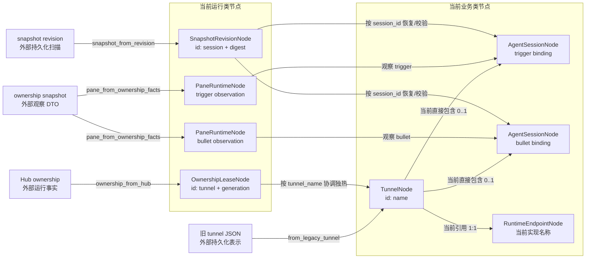
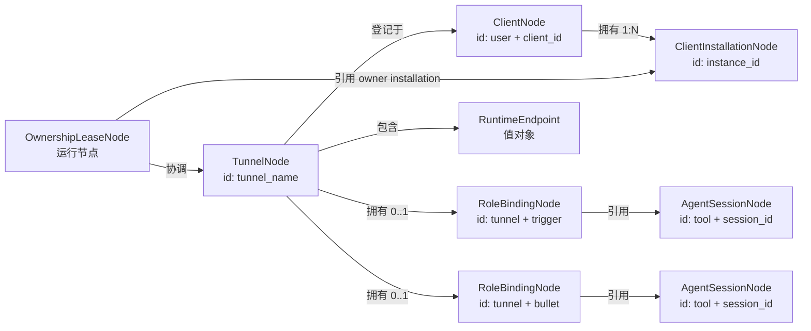

# dual-tmux DataNode 总览

本文是 dual-tmux 当前 DataNode 设计的统一说明，涵盖已经实现的模型、完整业务域规划、
运行节点、值对象、转换边界、关键不变量和后续演进。代码以
`datanode/models.py`、`datanode/adapters.py` 为准。

运行节点的 FSM 候选设计、状态/事件/迁移矩阵及待确认项见
[`RUNTIME_FSM.md`](RUNTIME_FSM.md)。该设计在用户确认前不会固化为 Graph/Machine。

## 1. 设计目标

DataNode 是程序在内存中实际使用的领域对象或运行对象，不等于数据库行、JSON、缓存、
接口载荷或临时字典。

这次抽象主要解决四个问题：

1. 把长期业务事实和短期运行状态分开，避免断网、锁屏或探测失败破坏 Tunnel；
2. 使用 Pydantic v2 固化字段类型和跨字段不变量，减少半合法 dict；
3. 收敛同一概念的多个事实源，例如 endpoint 与 `runtime.cmd`；
4. 为 CLI、Web 和服务端建立共同领域核心，但不立即替换当前稳定的 CLI 路径。

判断一个数据是否应成为节点，主要看它是否具有稳定身份、独立语义、约束和生命周期。
没有独立生命周期的组成部分应建成值对象；单次计算结果不强行建成节点。

## 2. 当前状态

当前代码已经实现第一版核心模型和旧数据适配，但尚未接管生产 CLI：

- 代码位置：项目根目录 `datanode/`；
- 模型使用 Pydantic v2，全部 `extra="forbid"`、冻结不可原地修改；
- 当前 CLI 继续使用原 tunnel dict，不受这一阶段影响；
- `adapters.py` 可以将旧 tunnel、Hub ownership、pane facts 和 snapshot revision 转成
  节点；
- 根目录 `datanode/` 暂未加入 wheel；
- 本机 13 个现有 tunnel 已全部通过只读转换验证。

当前实现是一份可执行的第一稿，不是最终完整业务模型。已经明确的主要缺口是
`RoleBindingNode`、`ClientNode` 和 `ClientInstallationNode`。

## 3. 当前已实现的节点关系



外部表示只在 Adapter 边界出现，不能反向决定领域模型。运行节点可以引用业务节点，
但不得复制、覆盖业务事实。

## 4. 当前业务节点

业务节点表达即使 tmux、daemon、SSH 和 Agent 进程全部停止，用户仍希望系统保留的
事实。

### 4.1 `TunnelNode`

`TunnelNode` 表示用户可操作的一条双端隧道，是当前业务聚合根。它不是 tunnel JSON，
也不是正在运行的一对 tmux 进程。

| 字段 | 含义 |
|---|---|
| `name` | Tunnel 身份，必须为 `dt-*` |
| `op` | Trigger 的 tmux 入口，必须为 `op_*` |
| `run` | Bullet 的 tmux 入口，必须为 `run_*` |
| `endpoint` | Bullet 的稳定工作位置 |
| `trigger` | 可选的 Trigger 会话；普通 DT 可以为空 |
| `bullet` | 可选的 Bullet 会话；普通 DT 可以为空 |
| `client` | 当前旧数据中的登记 Client |
| `user` | 所属用户 |
| `branched_from` | 可选的来源 Tunnel |
| `updated_at` | 业务记录更新时间 |

不变量：

- op 和 run 必须具有正确前缀且不能相同；
- trigger 字段只能容纳 `role=trigger` 的 Session；
- bullet 字段只能容纳 `role=bullet` 的 Session；
- Trigger 与 Bullet 不能绑定同一个 `session_id`；
- 未 freeze 的普通 DT 没有 Session 仍然合法；
- tmux 退出、断网、锁屏和 ownership 过期都不能删除 Tunnel。

生命周期：`dt new` 创建，`dt branch` 派生，freeze/bind 修改角色绑定，只有显式
`dt rm` 删除。

### 4.2 `AgentSessionNode`

当前实现用它表示某个 Tunnel 角色绑定的可恢复 Agent Session。

| 字段 | 含义 |
|---|---|
| `session_id` | Agent 原生 Session 身份 |
| `role` | 当前实现中的 `trigger` 或 `bullet` |
| `tool` | `opencode`、`codex`、`claude` 等 |
| `model` | 模型标识 |
| `slug` | Agent 原生会话简称 |
| `agent` | Agent 配置或模式 |
| `directory` | Agent Session 的工作目录 |
| `parser` | pane 输出解析器 |
| `frozen_at` | 最近形成可迁移绑定的时间 |
| `client` | 可选的 Agent 客户端元数据 |

Session 表示“应该恢复哪个会话”，不表示“当前有没有运行它”。pane down、tmux 重建、
SSH 断开都不能自动清除 Session。

当前模型把 Session 自身事实和角色绑定事实混在了一起。最终设计会把 `role`、
`parser`、`frozen_at` 移入 `RoleBindingNode`，让 Session 只表达 Agent 原生会话。

### 4.3 当前 `RuntimeEndpointNode`

Endpoint 回答“Bullet 恢复时应该到哪里工作”，不回答该位置此刻是否在线。

当前通过判别联合表达三种互斥位置：

| 类型 | 事实字段 | 约束 |
|---|---|---|
| `LocalEndpointNode` | `directory` | 当前 Client 本地工作目录 |
| `SshEndpointNode` | `server`、`port`、`directory` | server 必填，端口为 1–65535 |
| `DockerEndpointNode` | `server`、`port`、`container`、`directory` | server、container、directory 必填 |

`identity` 和 `reconnect_command` 都从位置字段派生。旧结构中的 `runtime.cmd` 不再被视为
独立事实源：

```text
server + port + container + directory
                    │
                    └──派生──> reconnect_command
```

虽然代码当前沿用 `Node` 名称，但最终分类应是 Tunnel 内的值对象，因为 Endpoint 没有
独立于 Tunnel 的创建、删除和持有关系。

## 5. 当前运行节点

运行节点表达系统为了可靠完成业务操作必须掌握的运行事实。它们可过期、可重建，不能
被当成业务交付结果。

### 5.1 `OwnershipLeaseNode`

表达 Hub 对某条 Tunnel 某一 generation 的独热控制事实。

| 字段 | 含义 |
|---|---|
| `tunnel_name` | 被协调的 Tunnel |
| `generation` | fencing generation，必须非负 |
| `state` | `free / expired / owned / foreign` |
| `holder` | 当前 Client owner |
| `instance_id` | 具体安装实例 |
| `protocol` | ownership 协议版本 |
| `renewed_at` | 最近续约时间 |
| `expires_at` | 租约截止时间 |

身份为 `tunnel_name + generation`。`owned/foreign` 必须有 holder；v2 active lease 还必须
有 instance ID。`succeeds(previous)` 用于检查 generation 不倒退。

Hub 是该节点的事实权威。它只能协调 Tunnel，不能改写 Tunnel、Session 或 Endpoint。

### 5.2 `PaneRuntimeNode`

表达某一时刻对某个角色 tmux pane 的观察。

| 字段 | 含义 |
|---|---|
| `tunnel_name + role + observed_at` | 观察身份 |
| `tmux_session` | 被观察的 tmux 名称 |
| `runtime` | `down / shell / transport / agent / unknown` |
| `attached` | `true / false / unknown` |
| `progress` | 工作进度观察 |
| `writers` | WriterEvidence |

`WriterEvidence` 的约束：

- 已知 count 必须与 PID 数量一致；
- duplicate 至少要有两个 PID；
- 探测失败必须是 `status=unknown, count=None`；
- unknown 不能伪装成零 writer。

Pane 节点是可丢弃的观察。采样失败、pane down 或 attached 未知不能反向清空 Session，
也不能单独成为清退本地 tmux 的证据。

### 5.3 `SnapshotRevisionNode`

表达用于选择、恢复和冲突判断的 Session snapshot revision，不复制完整会话内容。

| 字段 | 含义 |
|---|---|
| `session_id + digest` | revision 身份 |
| `digest` | 64 位 SHA-256 内容摘要 |
| `updated_at` | snapshot 更新时间 |
| `message_ids` | revision 包含的消息集合 |
| `tail_message_id` | revision 尾消息 |
| `source_tenant` | snapshot 来源租户 |

如果 tail 存在，它必须属于 `message_ids`。本地文件路径只是扫描过程信息，不进入节点；
完整 snapshot 文件仍是外部恢复载体，不成为第二份会话事实。

## 6. 当前辅助值对象

### `AgentClientMetadata`

保存 Agent 可执行文件的观测元数据：名称、版本、输出、路径、位置、host、container、
采集时间与错误。缺少这些信息不会让 Session 绑定失效。

### 枚举和值域

- `AgentRole`：`trigger / bullet`；
- `LeaseState`：`free / expired / owned / foreign`；
- `RuntimeKind`：`down / shell / transport / agent / unknown`；
- `WriterStatus`：`ok / duplicate / unknown`。

这些明确值域用来替代任意字符串和互相矛盾的布尔组合。

## 7. 当前转换边界

### `from_legacy_tunnel(record)`

把现有 tunnel JSON 转换为 `TunnelNode`。旧 side 的 `session_id` 为空时解释为“尚未
绑定”，不会构造伪造的空 Session，也不会把普通 DT 判坏。

### `to_legacy_tunnel(node, base=record)`

把节点投影回现有 JSON。通过 `base` 保留尚未迁移的 times、workpoint、恢复设置和未来
扩展字段；`runtime.cmd` 会从 Endpoint 重新派生。

### `ownership_from_hub(tunnel_name, lease)`

把 `hub.read_ownership()` 转为 `OwnershipLeaseNode`。Hub evidence、handoff 和 takeover
过程载荷不复制进 Lease；需要它们的操作应显式接收独立 DTO。

### `pane_from_ownership_facts(...)`

把 `ownership.snapshot()` 中一个 role 的 runtime、attached、progress 和 writers 转成
`PaneRuntimeNode`。

### `snapshot_from_revision(revision)`

把现有 OpenCode `SnapshotRevision` 转成 `SnapshotRevisionNode`，保留内容身份和冲突
判断事实，丢弃进程本地 Path。

## 8. 最终业务模型规划

当前第一稿没有覆盖 dual-tmux 的全部业务节点。核心业务域建议最终收敛为五个节点：

1. `TunnelNode`：隧道聚合根；
2. `AgentSessionNode`：Agent 原生可恢复会话；
3. `RoleBindingNode`：Tunnel 角色到 Session 的绑定；
4. `ClientNode`：用户可识别的操作端；
5. `ClientInstallationNode`：独热协议使用的稳定安装身份。



### 8.1 待实现 `RoleBindingNode`

它表达“某条 Tunnel 的某个角色绑定到哪个 Agent Session”。建议身份为
`tunnel_name + role`，包含：

- `session_ref = tool + session_id`；
- `role = trigger | bullet`；
- `parser`；
- `bound_at`、`frozen_at`；
- `bound_by_client_id`。

它负责的核心约束：

- 同一 Tunnel 的同一 role 最多一个当前 binding；
- Trigger 与 Bullet 不得引用同一 Session；
- 一次 pane 探测失败不能自动替换 binding；
- 不允许通过“最新 Session”猜测恢复目标；
- branch 是复用 Session 还是创建新 Session，必须是显式领域操作。

拆出 Binding 后，`AgentSessionNode` 将移除 `role`、`parser`、`frozen_at`，只保留 Agent
原生会话事实。

### 8.2 待实现 `ClientNode`

表示用户可识别、配置和选择的操作端，例如 `tm_ouc`、`tm_andy_home`。建议身份为
`user_id + client_id`，包含 display name、用户归属和服务模式能力。

Client 离线时仍是业务节点；它不是 daemon 进程，也不是某次 Lease holder 字符串。

### 8.3 待实现 `ClientInstallationNode`

表示独热安全协议可以验证的具体安装，身份为稳定 `instance_id`：

```text
ClientNode              用户认为“这是哪一端”
ClientInstallationNode  协议确认“这是哪个具体安装”
OwnershipLeaseNode      此刻哪个安装持有哪个 generation
```

它使以下规则可以明确表达：

- 同一 installation、同一 generation 的短暂过期可精确续约；
- 同名 Client 的不同 installation 仍必须 handoff 或 fenced takeover；
- 只有另一 installation 的更高 generation 或明确 handoff 才能清退旧 trigger。

### 8.4 最终值对象

- `RuntimeEndpoint`：Tunnel 内的工作位置；
- `AgentClientMetadata`：Agent 客户端观测元数据；
- `TunnelLineage`：branch 来源；如果未来需要独立审计再提升为关系节点。

## 9. 完整项目的扩展业务节点候选

这些不属于最小隧道内核，但对应项目已有能力。

| 节点 | 业务意义 | 与运行状态的边界 |
|---|---|---|
| `SkillNode` | 可发现、可版本化的技能 | 技能文件和安装缓存是外部表示 |
| `SkillAssignmentNode` | 技能分配给 global、Tunnel 或角色 | `dt skill used` 是审计事件，不是分配 |
| `MemoryFactNode` | 默认影响后续行为的长期事实 | 注入尝试和读取缓存是运行事实 |
| `AgentNoteNode` | 用户或 Agent 主动查询的笔记 | 不默认注入，不与 Memory 混合 |
| `OperatorIdentityNode` | 外部身份到操作者的稳定映射 | WebSocket 是否连接是运行事实 |
| `CommandRouteNode` | 操作者/命令作用域到 Client 的路由 | mailbox delivery 是运行尝试 |

飞书 connector lease、WebSocket 状态、event replay digest、confirmation token 和 mailbox
delivery attempt 不属于业务节点。

## 10. 独热体验约束

后续无论如何迁移节点，都必须维持以下产品不变量：

1. 新 Trigger 应在 10 秒内通过 cooperative handoff 或 fenced fault takeover 获得控制权；
2. 被明确接管的旧 Trigger 必须退出其 tmux attach，回到终端 shell；
3. 锁屏、睡眠、Hub 暂不可达、`free/expired` 本身不能清退本地 tmux；
4. 只有另一 installation 的更高 generation 或已提交 handoff 才构成清退证据；
5. 同一 installation、同一 generation 的短暂过期应原子续约；
6. Snapshot 冲突必须保护数据，不能覆盖、猜测或自动选择“最新会话”；
7. 现有 CLI 功能在整个迁移过程中不能被阉割。

## 11. 验证结果

当前 DataNode 已完成：

- 合法节点构造和未知字段拒绝；
- Tunnel、op、run 命名规则；
- Trigger/Bullet 角色与 Session 唯一性；
- local/SSH/Docker 判别联合；
- Docker 完整位置约束；
- reconnect command 派生；
- ownership active/v2/generation 约束；
- writer count、PID 和 unknown 语义；
- snapshot tail/message IDs 约束；
- 未 freeze DT 的兼容；
- legacy tunnel 往返时保留尚未建模字段；
- Hub ownership、pane facts、snapshot revision 的转换；
- 本机 13 个真实 tunnel 全量只读转换。

专项测试 15 个通过；项目完整回归通过，2 个环境型测试跳过。

## 12. 推荐演进顺序

1. 实现 `RoleBindingNode`，从 Session 中移出角色关系事实；
2. 实现 `ClientNode` 和 `ClientInstallationNode`；
3. 将 Endpoint 在命名和文档上正式调整为值对象；
4. 用现有 tunnel 与真实 Hub facts 再次验证转换；
5. 在 tunnel 加载边界启用 shadow validation，只记录问题，不阻断 CLI；
6. 让 Control Service 接受领域节点，CLI 与 Web 保持薄适配；
7. 分别迁移 ownership、pane observation 和 snapshot revision；
8. 稳定后迁入 `src/dual_tmux/datanode/` 并加入 wheel；
9. 最后逐步移除平行 dict 表示和过期兼容字段。

本阶段只明确节点、值对象、引用和转换边界，不展开 ownership、binding 或 recovery 的
FSM。状态迁移应在节点身份和不变量稳定后单独设计。
