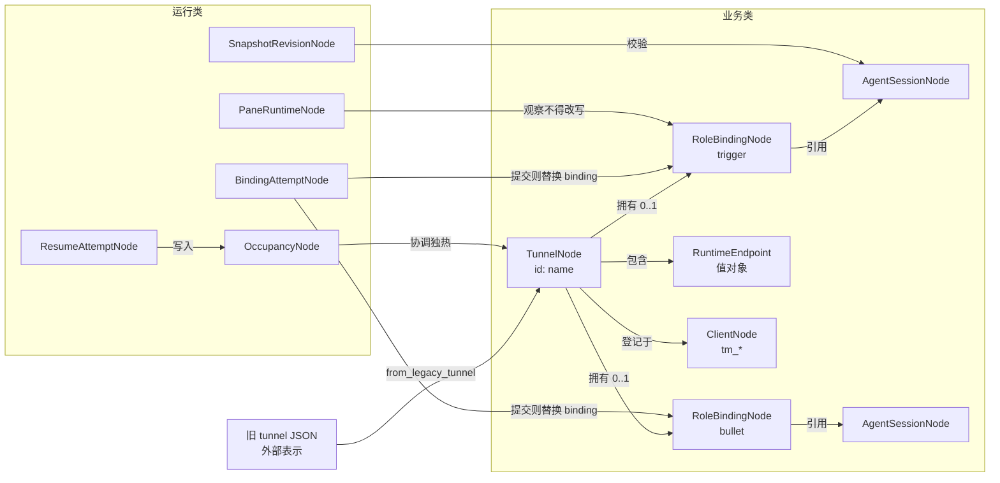

# dual-tmux DataNode 总览

本文是 dual-tmux 当前 DataNode 设计的统一说明。代码以
`datanode/models.py`、`datanode/adapters.py` 为准。

变化过程的 FSM 设计见 [`../docs/datanode-fsm.md`](../docs/datanode-fsm.md)。
BindingAttempt 的状态/事件在用户确认前不会接到热路径。

## 1. 设计目标

DataNode 是程序在内存中实际使用的领域对象，不等于 JSON、tmux 进程或接口载荷。

1. 长期业务事实和短期运行状态分开；
2. 用 Pydantic v2 固化不变量，减少半合法 dict；
3. 同一概念只有一个事实源，例如 endpoint 派生 `reconnect_command`；
4. CLI、Web、飞书共用同一领域核心；入口保持薄适配。

判断是否成为节点：稳定身份、独立语义、约束、生命周期。Endpoint 没有独立生命周期，
是 Tunnel 内的值对象。

## 2. 当前状态

- 业务核：`TunnelNode` 拥有 0..2 个 `RoleBindingNode`；Session 不再携带 role。
- 独热事实：`OccupancyNode`。`OwnershipLeaseNode` 仅测试遗留。
- CLI 仍走 tunnel dict；adapter 做只读/往返转换。
- BindingAttempt / ResumeAttempt 是运行过程节点。Resume 已有 shadow FSM；
  Binding Graph 待确认后实现。

## 3. 节点关系

运行节点可以引用业务节点，不得复制或覆盖业务事实。

## 4. 业务节点

### 4.1 `TunnelNode`

用户可操作的双端隧道。不是 JSON，也不是正在跑的 tmux。

DST 不是另一种对象：`is_dst` 当且仅当 trigger、bullet 两个 binding 都在。

不变量：

- `op_*` 与 `run_*` 不同；
- binding.role 必须与字段匹配，binding.tunnel_name 必须等于 name；
- 两端不能绑同一个 session_id；
- 未 freeze 仍然合法；
- tmux 退出、断网、锁屏、占用变更都不能删除 Tunnel。

### 4.2 `RoleBindingNode`

“这条隧道的这个角色，绑的是哪个会话”。身份：`tunnel + role`。

字段：`session`、`parser`、`frozen_at`、`bound_by_client`。

不变量：

- 同一 Tunnel 同一 role 最多一个当前 binding；
- 替换必须经 BindingAttempt 提交，pane 探测失败不能自动换成“最新会话”；
- rebuild 在新会话证明并 commit 成功前，旧 binding 仍有效。

### 4.3 `AgentSessionNode`

Agent 原生可恢复会话。身份：`tool + session_id`。

没有 `role` / `parser` / `frozen_at`。那些是绑定事实。

### 4.4 `ClientNode`

用户认识的机器端，身份 `tm_*`。Occupancy.holder 引用它。不是 daemon 进程。

不引入 `ClientInstallationNode`。独热不靠 instance fence。

### 4.5 `RuntimeEndpoint`（值对象）

Bullet 恢复时应去的位置：local / ssh / docker。`identity` 与 `reconnect_command`
从位置字段派生。旧 `runtime.cmd` 不是事实源。

## 5. 运行节点

### 5.1 `OccupancyNode`

当前哪台 `tm_*` 占用这条 Tunnel 的 trigger。无 TTL，后写覆盖。

Hub 文件 `occupancy/<name>.json` 是权威。它只协调独热，不改 Tunnel。

Hub 不可达、锁屏、睡眠、占用读不到，不得清退本地 tmux。

### 5.2 `BindingAttemptNode`

一次 freeze 或 rebuild。状态：`created / proving / committing / bound / rejected / failed`。

`committing`/`bound` 必须有已证明的 `candidate_session_id`。rebuild 不得提交与旧
session 相同的候选。

Graph/Machine 见 `docs/datanode-fsm.md`，确认前不接管 `freeze_sides`。

### 5.3 `PaneRuntimeNode`

一次 pane 观察。采样失败不能清空 binding，也不能单独清退 tmux。

### 5.4 `SnapshotRevisionNode`

恢复与冲突判断用的内容身份。tail 若存在必须在 `message_ids` 里。

### 5.5 `OwnershipLeaseNode`（遗留）

旧 lease 读取快照，供测试。不是独热热路径。

## 6. 转换边界

- `from_legacy_tunnel` / `to_legacy_tunnel`：side dict ↔ RoleBinding + Session。
  空 `session_id` 表示未绑定，不造假 Session。
- `occupancy_from_hub`：occupancy JSON → OccupancyNode。
- `pane_from_ownership_facts`：观察 DTO → PaneRuntimeNode。
- `snapshot_from_revision`：OpenCode revision → SnapshotRevisionNode，丢弃 Path。

## 7. 独热与 DST 不变量

1. 新端 `resume`：拉 DST → tick 选源 → persist 预检 → 写占用 → 按 binding 恢复。
2. 被占用的旧端 daemon 把本机 tmux 退回 shell；不杀远端 bullet agent。
3. freeze / rebuild 只记录已证明的 session id，不猜最新会话。
4. CLI 动词不减少：`new / enter / work / freeze / resume / drop / ls / pull / push`。

## 8. 扩展业务候选（非内核）

Skill、Memory、Note、Operator、CommandRoute 仍是完整项目候选，不进入 Binding FSM。

## 9. 演进顺序

1. 节点边界（本步）：RoleBinding 从 Session 拆出，Occupancy 为独热事实。
2. 确认 BindingAttempt 状态/事件后实现 Graph/Machine 与 hooks。
3. ControlService 发事件；CLI/Web 保持薄入口。
4. shadow 校验真实 tunnel，再逐步去掉平行 dict。

本阶段已把节点身份和不变量可执行化。变化约束交给 FSM，不把流程塞回 dict 分支。
