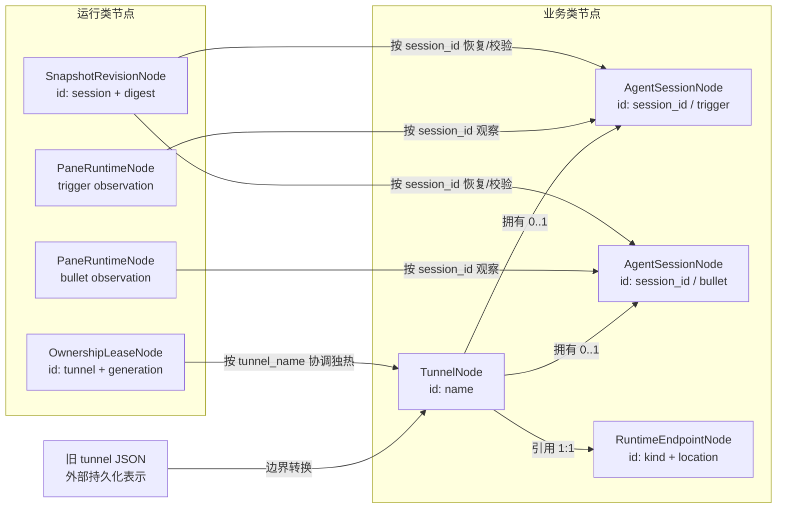

# dual-tmux DataNode 抽象

> 当前 DataNode 的统一说明见 [`DATANODE.md`](DATANODE.md)。
>
> 运行节点与 FSM 候选设计见 [`RUNTIME_FSM.md`](RUNTIME_FSM.md)。
>
> 业务节点的完整盘点、当前第一稿的缺口与下一步调整，见
> [`BUSINESS_NODES.md`](BUSINESS_NODES.md)。本文主要说明当前已经实现并测试的第一版
> 模型。

这里定义 dual-tmux 的第一版运行时领域节点。它的目的不是给现有 JSON
换一个类型外壳，而是建立稳定的事实边界，让 CLI、Web 和后续服务共同调用同一套
领域语义。

当前阶段是兼容式抽象：现有 CLI 仍按原路径工作，`adapters.py` 只在边界把旧 tunnel
JSON 转成节点。根目录 `datanode/` 已作为过渡包进入 wheel，供 Resume shadow FSM
导入；业务领域模型尚未替换现行 CLI 的 tunnel dict。稳定后再逐入口迁移到
`src/dual_tmux`。

## 节点关系

逐边语义：

- `TunnelNode` 保存 trigger/bullet 绑定。未 freeze 的普通 DT 没有绑定，因此是
  `0..1`，不能因为缺 session 被判成坏数据；绑定的创建和替换来自明确的 freeze、
  bind 或 resume 操作。
- `TunnelNode` 保存一个 endpoint 引用。endpoint 表达 bullet 的稳定工作位置；重连
  命令由它派生，不再成为另一个独立事实源。
- Hub 持有 `OwnershipLeaseNode`。它只引用 tunnel identity，不拥有或复制 tunnel；
  generation 变化不得改写业务绑定。
- pane 节点是某时刻的观察，daemon/CLI 采样后即可失效。它不能反向覆盖 session
  binding，锁屏或采样失败也不能据此清退本地 tmux。
- snapshot revision 由持久化扫描创建，按 session ID 关联；它只保存冲突判断所需的
  revision 事实，不复制完整会话内容。

## 业务类节点

### `TunnelNode`

- 身份：`name`，当前唯一性范围是一个 dual-tmux Hub，格式必须为 `dt-*`。
- 事实：`op`、`run`、endpoint、两个可选的角色绑定、登记 Client/User。
- 不变量：op 为 `op_*`，run 为 `run_*`；角色必须与字段一致；两端不能绑定同一个
  session。
- 生命周期：`dt new` 创建，`dt rm` 删除；tmux 进程退出不会删除该业务事实。

### `AgentSessionNode`

- 身份：Agent 原生 `session_id`；role 是它在一个 tunnel 内的绑定语义。
- 事实：tool、model、slug、agent、directory 及可选客户端版本元数据。
- 生命周期：freeze/bind 建立，显式换模型或重新绑定时替换；pane down 不等于失效。

### `RuntimeEndpointNode`

- 使用 `local | ssh | docker` 判别联合，杜绝 container 存在但 server 为空等非法组合。
- Docker 必须具备 server、container、directory；SSH 必须具备 server 和合法端口。
- `identity` 与 `reconnect_command` 都是派生值，不持久化为第二事实源。

## 运行类节点

### `OwnershipLeaseNode`

- 身份：`tunnel_name + generation`，它是 Hub 发布的版本化协调记录，不是 append-only
  共识日志；Hub 是权威所有者。
- active (`owned/foreign`) 必须有 holder；v2 active 还必须有 instance ID。
- `succeeds()` 显式检查 generation 不倒退。真正的 acquire/renew/handoff/fence 后续应由
  独立领域操作或 attempt FSM 约束；Lease 自身不建立长流程 FSM。

### `PaneRuntimeNode`

- 身份：`tunnel + role + observed_at`，是可丢弃、可重建的观察事实。
- writer 的已知 count 必须与 PID 数量一致；duplicate 至少有两个 PID；探测失败用
  unknown + `count=None`，不能伪装成零 writer。

### `SnapshotRevisionNode`

- 身份：`session_id + SHA-256 digest`。
- tail 若存在，必须属于 message IDs；用于恢复选择与冲突拒绝。
- 完整 snapshot 文件仍是外部内容载体，节点不复制它成为第二事实源。

## 转换边界和后续接入

`from_legacy_tunnel()` 接受持久化记录并构造合法节点；空 side 被解释为“尚未绑定”，
而不是伪造空 session 节点。`to_legacy_tunnel(node, base=record)` 更新已建模字段，同时
保留 times、workpoint、恢复配置等尚未迁移的旧字段。

运行边界分别由 `ownership_from_hub()`、`pane_from_ownership_facts()` 和
`snapshot_from_revision()` 承接。Hub evidence、handoff/takeover 请求、snapshot 文件路径
等传输或过程数据不会塞回节点；需要它们的领域操作应显式接收相应 DTO。

建议后续按以下次序接入，每一步保持 CLI 回归：

1. 在加载/保存边界启用 shadow validation，只记录不合法旧数据，不阻断用户。
2. 让 Control Service 接受节点，CLI 与 Web 继续作为薄适配层。
3. 将 ownership、pane observation、snapshot revision 分别切换为运行节点。
4. 根目录包已进入 wheel；稳定后迁入 `src/dual_tmux/datanode/`，再逐步移除平行 dict
   表示。

接入时必须维持既有体验：正常 DT 和 DST 都可直接使用；新 trigger 在 10 秒内通过
handoff 或 fenced fault takeover 获得控制权；只有明确的更高 generation/交接证据才能
清退旧 trigger，锁屏、网络不可达或普通租约过期本身不得清退本地 tmux。
