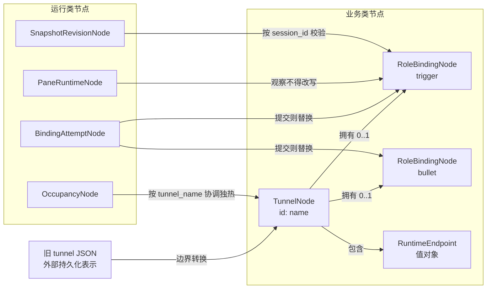

# dual-tmux DataNode 抽象

> 当前 DataNode 的统一说明见 [`DATANODE.md`](DATANODE.md)。
>
> 运行节点与 FSM 候选设计见 [`RUNTIME_FSM.md`](RUNTIME_FSM.md)。
>
> BindingAttempt 状态/事件确认稿见 [`../docs/datanode-fsm.md`](../docs/datanode-fsm.md)。
>
> 业务节点盘点见 [`BUSINESS_NODES.md`](BUSINESS_NODES.md)。

这里定义 dual-tmux 的第一版运行时领域节点。它的目的不是给现有 JSON
换一个类型外壳，而是建立稳定的事实边界，让 CLI、Web 和后续服务共同调用同一套
领域语义。

当前阶段是兼容式抽象：现有 CLI 仍按原路径工作，`adapters.py` 只在边界把旧 tunnel
JSON 转成节点。根目录 `datanode/` 已作为过渡包进入 wheel，供 Resume shadow FSM
导入；业务领域模型尚未替换现行 CLI 的 tunnel dict。稳定后再逐入口迁移到
`src/dual_tmux`。

## 节点关系

逐边语义：

- `TunnelNode` 拥有 0..2 个 `RoleBindingNode`。未 freeze 的 DT 没有绑定，不能因此判坏。
- Endpoint 是值对象；重连命令由位置派生。
- `OccupancyNode` 只协调独热，不改 binding。
- pane 是观察，不能反向覆盖 binding，也不能单独清退本地 tmux。
- BindingAttempt 提交成功才替换 binding；rebuild 在 commit 前保留旧 DST。

## 业务类节点

### `TunnelNode`

- 身份：`name`，当前唯一性范围是一个 dual-tmux Hub，格式必须为 `dt-*`。
- 事实：`op`、`run`、endpoint、两个可选的角色绑定、登记 Client/User。
- 不变量：op 为 `op_*`，run 为 `run_*`；角色必须与字段一致；两端不能绑定同一个
  session。
- 生命周期：`dt new` 创建，`dt rm` 删除；tmux 进程退出不会删除该业务事实。

### `RoleBindingNode`

- 身份：`tunnel + role`。
- 事实：引用的 AgentSession、parser、frozen_at、bound_by_client。
- 生命周期：freeze / rebuild commit 时替换；pane down 不等于失效。

### `AgentSessionNode`

- 身份：`tool + session_id`。没有 role。
- 事实：model、slug、agent、directory 及可选客户端元数据。
- 生命周期：原生会话存在即可；解绑后仍可存在。

### `RuntimeEndpointNode`

- 使用 `local | ssh | docker` 判别联合，杜绝 container 存在但 server 为空等非法组合。
- Docker 必须具备 server、container、directory；SSH 必须具备 server 和合法端口。
- `identity` 与 `reconnect_command` 都是派生值，不持久化为第二事实源。

## 运行类节点

### `OccupancyNode`

- 身份：`tunnel_name + generation`。无 TTL，后写覆盖。
- holder 是 `tm_*`。它只协调独热，不改 binding。

### `BindingAttemptNode`

- 一次 freeze 或 rebuild。Graph 待状态确认后接入。

### `PaneRuntimeNode`

- 身份：`tunnel + role + observed_at`，是可丢弃、可重建的观察事实。
- writer 的已知 count 必须与 PID 数量一致；duplicate 至少有两个 PID；探测失败用
  unknown + `count=None`，不能伪装成零 writer。

### `SnapshotRevisionNode`

- 身份：`session_id + SHA-256 digest`。
- tail 若存在，必须属于 message IDs；用于恢复选择与冲突拒绝。
- 完整 snapshot 文件仍是外部内容载体，节点不复制它成为第二事实源。

## 转换边界和后续接入

`from_legacy_tunnel()` 接受持久化记录并构造合法节点；空 side 被解释为“尚未绑定”，
而不是伪造空 session 节点。`to_legacy_tunnel(node, base=record)` 更新已建模字段，同时
保留 times、workpoint、恢复配置等尚未迁移的旧字段。

运行边界分别由 `ownership_from_hub()`、`pane_from_ownership_facts()` 和
`snapshot_from_revision()` 承接。Hub evidence、handoff/takeover 请求、snapshot 文件路径
等传输或过程数据不会塞回节点；需要它们的领域操作应显式接收相应 DTO。

建议后续按以下次序接入，每一步保持 CLI 回归：

1. 在加载/保存边界启用 shadow validation，只记录不合法旧数据，不阻断用户。
2. 让 Control Service 接受节点，CLI 与 Web 继续作为薄适配层。
3. 将 ownership、pane observation、snapshot revision 分别切换为运行节点。
4. 根目录包已进入 wheel；稳定后迁入 `src/dual_tmux/datanode/`，再逐步移除平行 dict
   表示。

接入时必须维持既有体验：正常 DT 和 DST 都可直接使用；新 trigger 在 10 秒内通过
handoff 或 fenced fault takeover 获得控制权；只有明确的更高 generation/交接证据才能
清退旧 trigger，锁屏、网络不可达或普通租约过期本身不得清退本地 tmux。
