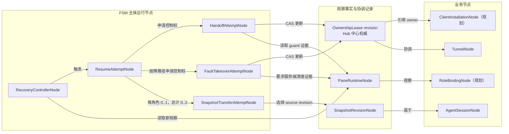
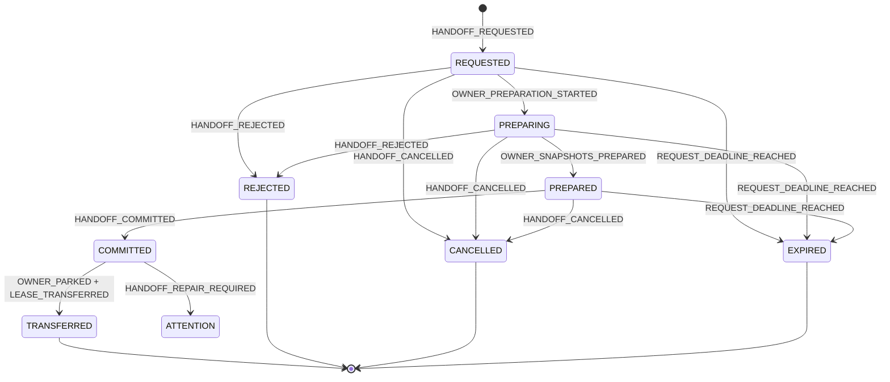
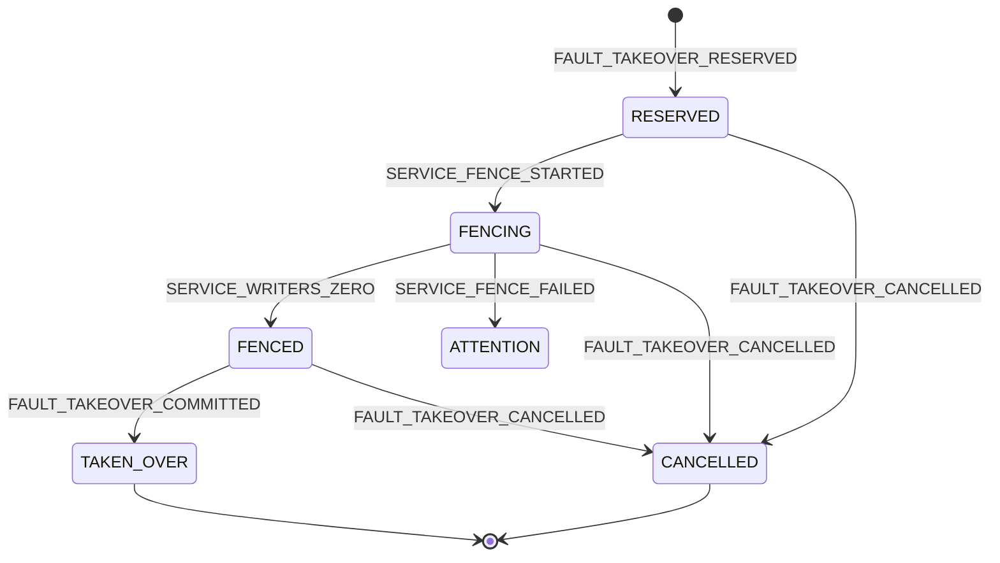
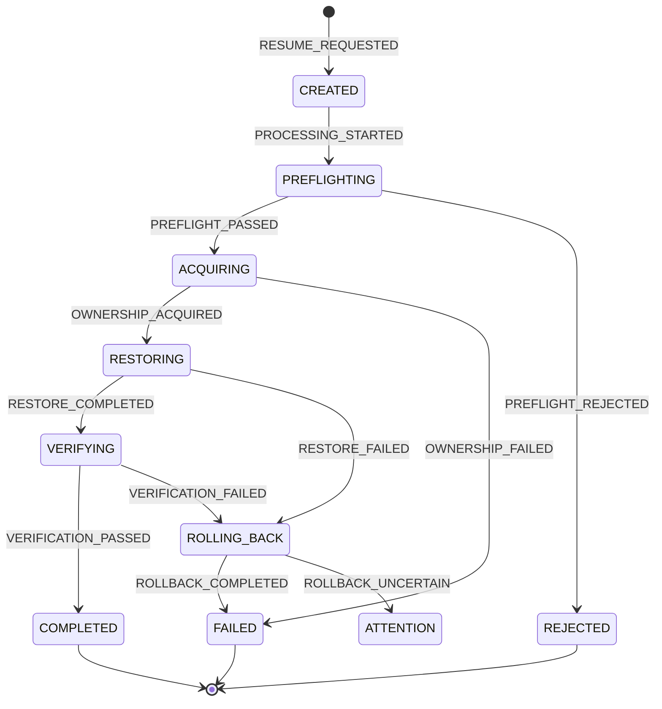
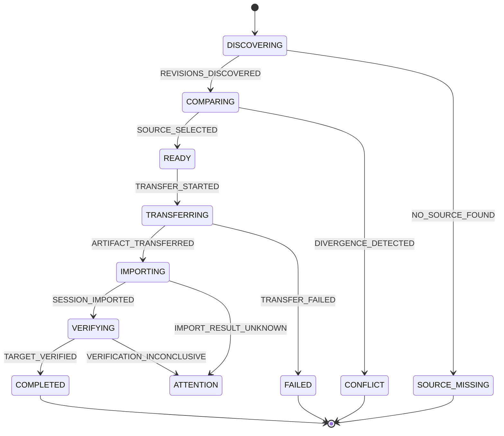
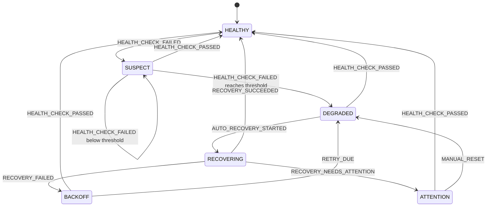

# dual-tmux 运行节点与 FSM 设计基线
> **机制更正（2026-09-10）**：Lease / Handoff / FaultTakeover 作为日常独热已被判定为过渡设计。权威模型改为占用文件，见 [`docs/core-architecture.md`](../docs/core-architecture.md) 与根目录 `ROADMAP.md`。本文保留供 S6 拆除前对照，不再作为实现方向。

> 状态：**核心状态、事件和六项取舍已确认；开始分阶段实现 Graph/Machine**。
>
> 本文遵循 `fsm-agenty`：先确认运行节点、核心状态、事件和迁移，再使用固定
> Graph + Machine 基线实现。2026-09-09 根据架构评审完成术语与时序修正，并作为首版
> 实现基线。

## 1. 设计结论

当前 `OwnershipLeaseNode`、`PaneRuntimeNode`、`SnapshotRevisionNode` 只表达了部分运行
事实，还不足以完整约束独热接管、恢复和 snapshot 同步。

运行节点应调整为两组：

### 事实快照与协调记录，不直接拥有长流程 FSM

- `OwnershipLeaseNode`：中心 Hub 当前发布的版本化协调记录，包含 owner、installation、
  generation 和有效期；
- `PaneRuntimeNode`：某一时刻的 pane/attached/progress/writer 观察；
- `SnapshotRevisionNode`：一个不可变的 snapshot 内容修订。

这三类节点本身不应通过 FSM 被逐步“改成另一个事实”：Pane 和 Snapshot 每次采样产生
新节点；Lease 由 Hub 原子命令发布新 revision，其 `owned/foreign/expired` 是读取者视角和
时间共同派生的状态。

### 有持续过程、需要 FSM 的运行节点

1. `HandoffAttemptNode`：活动 owner 向新 installation 协作交接；
2. `FaultTakeoverAttemptNode`：旧 Lease 过期后，服务端 fenced cleanup 与原子接管；
3. `ResumeAttemptNode`：一次用户 `dt resume` 从预检到恢复、验证、回滚的全过程；
4. `SnapshotTransferAttemptNode`：选择、比较、传输、导入并验证指定 Session revision；
5. `RecoveryControllerNode`：连续健康失败、自动恢复、退避与熔断。

Ownership 不是五台互不相关的机器。`HandoffAttemptNode` 与
`FaultTakeoverAttemptNode` 由同一个 Hub `OwnershipCoordinatorMachine` 协调，并原子更新
`OwnershipLeaseNode`；同一 Tunnel 同一 generation 最多只能存在一个未终结的 ownership
attempt。

## 2. 总体关系

## 3. 共通原则

### 3.1 中心仲裁、协调记录与派生视图分离

dual-tmux 不是 Raft/Paxos 等多副本共识系统。多个 Client 服从 m7 Hub 这一单一
ownership 权威；flock、generation 和 CAS 构成中心化租约仲裁协议。它能解决 Client
之间的独热控制，但 Hub 本身仍是控制面可用性边界。

Hub 权威 Lease 建议只保存：

- `tunnel_name`；
- `holder_client_id`；
- `holder_instance_id`；
- `generation`；
- `renewed_at`、`expires_at`；
- `protocol_version`；
- `revision/CAS token`。

每次 CAS、renew 或 release 都发布一个新的 Lease revision。逻辑读取快照不可变，但
当前实现不承诺保存 append-only Lease 历史。下列值由读取者派生，不作为 Hub FSM 权威
状态：

- `owned`：holder installation 等于当前 installation 且未过期；
- `foreign`：holder installation 不同且未过期；
- `expired`：存在 holder 但已超过有效期；
- `free`：没有 holder。

这样不会把“我是 owner”和“另一端是 owner”误当成服务端两种本体状态。

### 3.2 未声明迁移默认非法

任何状态下没有列出的事件都必须被拒绝，拒绝时：

- Machine state 不变；
- 节点快照不变；
- 不执行 tmux、SSH、Hub 写入等副作用；
- 返回稳定的错误码，而不是仅返回异常文本。

### 3.3 外部副作用必须有提交边界

FSM 内存切换不等于 Hub、tmux、snapshot 文件已经成功。设计采用以下原则：

- Guard 只读、无副作用；
- 进入中间状态前先持久化 attempt；
- 外部动作完成后用携带 evidence 的事件推进；
- Hub ownership 发布使用 generation + revision 的 CAS；
- 进程重启后从持久化状态重建计时器和连接，不序列化线程、SSH、tmux handle；
- 对已提交但响应丢失的操作，通过 request ID 幂等查询/重试，不猜测结果。

Snapshot 操作分成两个阶段：Lease 转移前只允许 owner export、持久化、校验不可变
artifact，claimant 最多预下载缓存；会修改目标 Session、创建 tmux 或启动 Agent writer
的 import/restore 必须在 claimant 已获得并重新验证 Lease 后执行。这不是通用数据库
两阶段提交，而是带不可逆 commit 点的 fenced handoff protocol。

## 4. Ownership Coordinator

### 4.1 节点前提

| 项目 | 内容 |
|---|---|
| Machine 主体 | `OwnershipCoordinatorMachine`，身份 `tunnel_name`，Hub 单点权威 |
| 协调节点 | 一个 `OwnershipLeaseNode`，加至多一个活动的 Handoff 或 FaultTakeover attempt |
| 节点不变量 | generation 单调递增；同 generation 至多一个活动 attempt；只有 Hub CAS 可发布 owner |
| 持久化字段 | Lease、活动 attempt、request ID、deadline、expected generation、双方 installation |
| 运行期资源 | Hub flock/CAS、计时器、SSH/daemon 通道；恢复时重建，不序列化 |

### 4.2 `HandoffAttemptNode`

身份：`request_id`；幂等范围：`tunnel_name + expected_generation + claimant_instance_id`。

建议字段：

- `request_id`；
- `tunnel_name`；
- `expected_generation`；
- `owner_client_id`、`owner_instance_id`；
- `claimant_client_id`、`claimant_instance_id`；
- `state`；
- `requested_at`、`deadline_at`、`committed_at`、`decided_at`；
- `reason`；
- `persist_evidence`、`park_evidence`（仅保存摘要/引用，不保存进程资源）。

Lease 本身虽然不建立长流程 FSM，但 Hub 发布新 Lease revision 必须遵守以下命令契约：

| 命令 | Guard | 发布结果 | 失败时 |
|---|---|---|---|
| `CLAIM` | Lease free，或由已完成 attempt 授权；CAS 匹配 | 发布 holder 与合法 generation | Lease 不变 |
| `RENEW` | client、instance、generation 精确匹配，且无 foreign fault reservation | generation 不变，只更新 deadline/revision | Lease 不变，调用端进入 unconfirmed |
| `RELEASE` | owner installation 与 generation 精确匹配 | 清 holder，保留 generation 单调性 | Lease 不变 |
| `HANDOFF_TRANSFER` | Handoff COMMITTED 且 persist/park evidence 完整 | claimant 成为 holder，generation+1 | attempt 保持 COMMITTED/ATTENTION |
| `FAULT_COMMIT` | Fault FENCED 且 reservation/CAS 匹配 | claimant 成为 holder，generation+1 | attempt 保持 FENCED/ATTENTION |

普通 `CLAIM` 不得绕过 Handoff 或 FaultTakeover 直接覆盖 active/foreign/expired v2 owner。

#### 核心状态

| 状态 | 业务含义 | 允许行为 | 进入条件 | 离开条件 | 终态/恢复 |
|---|---|---|---|---|---|
| `REQUESTED` | Claimant 已请求，owner 尚未开始准备 | owner 评估；claimant 取消 | Lease/generation 匹配，无其他活动 attempt | prepare/reject/cancel/deadline | 可恢复 |
| `PREPARING` | Owner 已通过 Guard，正在制作并同步 snapshot | 重做幂等 persist；claimant 仍可取消 | owner 身份与可持久化条件成立 | prepared/reject/cancel/deadline | 可恢复，重启后重新验证/同步 |
| `PREPARED` | Snapshot 已持久化验证，尚未作不可逆承诺 | owner commit；claimant 仍可取消 | 两侧 persist evidence 齐全 | commit/cancel/deadline | 可恢复 |
| `COMMITTED` | Owner 已作不可逆交接承诺，claimant 不能撤回 | owner park、transfer | PREPARED 且 deadline 未过 | transfer 或执行失败 | 可恢复，重启后继续 park/transfer |
| `TRANSFERRED` | 新 generation 已原子发布给 claimant | 幂等查询 | persist、park 均有成功证据，CAS 成功 | 无 | 终态 |
| `REJECTED` | Owner 明确拒绝 | 查询原因 | Guard 不满足或协议不兼容 | 无 | 终态 |
| `CANCELLED` | Claimant 在 commit 前取消 | 幂等查询 | 当前仍为 REQUESTED | 无 | 终态 |
| `EXPIRED` | commit 前超过 deadline | 重新发起新 request | deadline 到达 | 无 | 终态 |
| `ATTENTION` | commit 后副作用反复失败，不能安全判定完成 | 管理员恢复/重试 | 无法证明 park 或原子发布结果 | repair/人工处置 | 可恢复 |

`COMMITTED` 不能自动超时回滚成 `CANCELLED`：一旦 owner 承诺并可能已经开始 park，取消会
产生双活歧义。它必须继续完成、幂等修复或进入 `ATTENTION`。

#### 核心事件

| 事件 | 已发生的事实 | 发出者 | 载荷 | 可发生状态 | 重复语义 |
|---|---|---|---|---|---|
| `HANDOFF_REQUESTED` | Claimant 请求接管 | CLI/Web/Resume Machine | request、claimant、expected generation、deadline | 新建 | 同幂等键返回原 attempt |
| `OWNER_PREPARATION_STARTED` | Owner Guard 通过并开始持久化 | owner daemon | owner identity、input revisions | REQUESTED | 同 request 幂等 |
| `OWNER_SNAPSHOTS_PREPARED` | 两端 snapshot 已同步并验证 | owner daemon | persist evidence | PREPARING | 同 evidence 幂等 |
| `HANDOFF_COMMITTED` | Owner 在 persist 后承诺 park | owner daemon | owner identity、persist evidence | PREPARED | 同 request 幂等 |
| `HANDOFF_REJECTED` | Owner 明确拒绝 | owner daemon | reason | REQUESTED/PREPARING | 终态幂等 |
| `HANDOFF_CANCELLED` | Claimant 在 commit 前取消 | claimant | request ID | REQUESTED/PREPARING/PREPARED | 终态幂等 |
| `REQUEST_DEADLINE_REACHED` | 未承诺请求已过期 | Hub timer/read repair | observed time | REQUESTED/PREPARING/PREPARED | 幂等 |
| `OWNER_PARKED` | 旧端两个 tmux 均已退出 | owner daemon | park evidence | COMMITTED | 同 evidence 幂等 |
| `LEASE_TRANSFERRED` | Hub 已发布 claimant + generation+1 | Hub CAS action | new Lease revision | COMMITTED | 按 request ID/CAS 幂等 |
| `HANDOFF_REPAIR_REQUIRED` | commit 后不能证明完成或回滚 | daemon/Hub repair | error/evidence | COMMITTED | 保留首次根因，追加 attempt log |

#### 迁移矩阵

| 当前状态 | 事件 | Guard | 下一状态 | 副作用 | 失败/重试语义 |
|---|---|---|---|---|---|
| 无 | HANDOFF_REQUESTED | active Lease、claimant 非 owner、generation 相等、无活动 attempt | REQUESTED | 原子保存 request | 同幂等键返回原节点 |
| REQUESTED | OWNER_PREPARATION_STARTED | owner installation 匹配；pane/session 可持久化 | PREPARING | 保存输入 revision，开始 snapshot persist | 重启后重新验证，重复同步按 digest 幂等 |
| PREPARING | OWNER_SNAPSHOTS_PREPARED | 两端 snapshot 同步并验证 | PREPARED | 保存 persist evidence | 响应丢失按 evidence 查询 |
| REQUESTED/PREPARING | HANDOFF_REJECTED | 事件来自 owner且尚未 commit | REJECTED | 保存原因 | 终态幂等 |
| REQUESTED/PREPARING/PREPARED | HANDOFF_CANCELLED | 事件来自 claimant且尚未 commit | CANCELLED | 清活动引用 | commit 已发生则拒绝 `too_late` |
| REQUESTED/PREPARING/PREPARED | REQUEST_DEADLINE_REACHED | `now >= deadline_at` | EXPIRED | 清活动引用 | 延迟事件对终态无效 |
| PREPARED | HANDOFF_COMMITTED | owner/Lease/generation/persist evidence 匹配；deadline 未到 | COMMITTED | CAS 保存不可逆 commit | 响应丢失可按 request 查询 |
| COMMITTED | OWNER_PARKED | op/run tmux 均不存在 | COMMITTED | 记录 park evidence，尝试 transfer | 重试 park 必须按 exact tmux identity 幂等 |
| COMMITTED | LEASE_TRANSFERRED | request/generation/CAS 匹配且已有 persist+park evidence | TRANSFERRED | 发布 claimant、generation+1 | sidecar/lock 分步写用 repair 完成同一决定 |
| COMMITTED | HANDOFF_REPAIR_REQUIRED | 无法确认 transfer 或 park | ATTENTION | 告警，保持 fail-closed | 不恢复旧 owner、不另发 generation |

### 4.3 `FaultTakeoverAttemptNode`

身份：`request_id`；它只处理**过期且不属于同一 installation 精确续约**的 Lease。

建议字段：expected Lease revision、claimant、previous owner、state、started/deadline、
service cleanup evidence、commit revision、failure reason。

#### 核心状态

| 状态 | 含义 | 关键约束 | 终态/恢复 |
|---|---|---|---|
| `RESERVED` | Hub 已冻结旧 generation 的续约能力 | 只有该 claimant/request 可继续 | 可恢复 |
| `FENCING` | 正在服务端查找并清理精确 Session writer | 只能按绑定 Session ID 清理 | 可恢复 |
| `FENCED` | 已证明远端 writer 为零 | 必须有可验证 evidence | 可恢复 |
| `TAKEN_OVER` | Hub 原子发布 claimant + generation+1 | CAS 与 reservation 匹配 | 终态 |
| `CANCELLED` | commit 前取消且旧 Lease 未改变 | reservation 已释放 | 终态 |
| `ATTENTION` | 清理或提交结果不能安全确认 | 不得启动新 writer | 可恢复 |

#### 核心事件与迁移

| 当前状态 | 事件 | Guard | 下一状态 | 副作用 | 失败/重试语义 |
|---|---|---|---|---|---|
| 无 | FAULT_TAKEOVER_RESERVED | Lease 已过期；非同 installation 精确续约；generation/CAS 匹配 | RESERVED | Hub 冻结旧 generation 续约 | 同 request 幂等 |
| RESERVED | SERVICE_FENCE_STARTED | endpoint 与绑定 Session 明确 | FENCING | SSH 到中心服务控制的 endpoint | 连接失败保持 reservation，可取消 |
| FENCING | SERVICE_WRITERS_ZERO | 精确 Session writer probe=0 | FENCED | 保存 probe/evidence 摘要 | 重复 probe 幂等 |
| FENCING | SERVICE_FENCE_FAILED | probe unknown 或 kill 后仍有 writer | ATTENTION | 告警 | 不发布新 generation |
| FENCED | FAULT_TAKEOVER_COMMITTED | reservation、claimant、generation 均匹配 | TAKEN_OVER | 原子发布 generation+1 | 响应丢失按 request repair |
| RESERVED/FENCING/FENCED | FAULT_TAKEOVER_CANCELLED | 尚未 commit，取消者是 claimant | CANCELLED | 释放 reservation | committed 则返回 already_committed |

物理边界：Hub 能阻止旧 installation 续约，并能通过服务 endpoint 清理远端 Bullet；它
不能在一台完全离线且不受服务端控制的 Client 上物理 kill 本地进程。因此新 generation
是逻辑 fencing 权威，旧端恢复连接后必须看到更高 generation 并退出 tmux。

## 5. `ResumeAttemptNode`

### 5.1 节点前提

| 项目 | 内容 |
|---|---|
| FSM 主体节点 | `ResumeAttemptNode`，身份 `attempt_id`，一次用户/Recovery resume 一个实例 |
| 引用 | Tunnel、claimant installation、expected binding revisions、Lease/Handoff/Fault attempt |
| 节点不变量 | 未获 Lease 不启动 writer；验证通过前不宣告成功；新获 Lease失败时必须 park/release或 attention |
| 持久化字段 | state、阶段时间、ownership token、两个 transfer ID、错误、rollback evidence |
| 运行期资源 | keepalive thread、tmux/SSH handle、终端 attach；恢复时重建 |

### 5.2 核心状态

| 状态 | 业务含义 | 允许行为 | 进入条件 | 离开条件 | 终态/恢复 |
|---|---|---|---|---|---|
| `CREATED` | Resume 请求已登记 | 开始只读预检 | 请求与 Tunnel/claimant 合法 | preflight | 可恢复 |
| `PREFLIGHTING` | 校验 binding、snapshot、endpoint、ownership facts | 只读探测 | CREATED | pass/reject/fail | 可恢复，可重新探测 |
| `ACQUIRING` | 正在续约、claim、handoff 或 fault takeover | 只执行 ownership 协议 | preflight 通过 | acquired/fail | 可恢复 |
| `RESTORING` | 已持有 Lease，正在恢复 endpoint、snapshot 和 Agent | keepalive；恢复两端 | ownership token 已验证 | restored/fail | 可恢复 |
| `VERIFYING` | 检查 generation 与每端恰好一个 writer | 只读验证、短时等待 | restore 动作完成 | pass/fail | 可恢复 |
| `COMPLETED` | Session 可用且 Lease/writer 均验证成功 | 返回结果、允许 attach | verification passed | 无 | 终态 |
| `REJECTED` | 预检发现业务冲突，未发生所有权/tmux 变更 | 展示可操作原因 | snapshot 冲突、binding 缺失、endpoint 歧义等 | 新 attempt | 终态 |
| `ROLLING_BACK` | 新获 Lease 后恢复失败，正在 park/release | 只执行补偿 | acquired 后失败 | rolled back/failed | 可恢复 |
| `FAILED` | 未产生双活风险且本次尝试失败 | 可重试新 attempt | acquire 失败或回滚成功 | 新 attempt | 终态 |
| `ATTENTION` | 已有外部副作用但无法证明回滚/成功 | 人工/repair | park、release 或 commit 结果未知 | repaired | 可恢复 |

### 5.3 核心事件

| 事件 | 业务事实 | 发出者 | 主要载荷 | 重复语义 |
|---|---|---|---|---|
| `RESUME_REQUESTED` | 用户或 Recovery 请求恢复 | CLI/Web/Recovery | tunnel、claimant、force intent | 创建新 attempt；同 idempotency key 返回原 attempt |
| `PREFLIGHT_PASSED` | 所有只读检查已通过 | Resume worker | Tunnel/binding/snapshot/Lease revisions | 同 revisions 幂等 |
| `PREFLIGHT_REJECTED` | 发现不能安全继续的明确原因 | Resume worker | 稳定 reason code、evidence refs | 终态幂等 |
| `OWNERSHIP_ACQUIRED` | claimant 已拥有已验证 generation | Ownership coordinator | Lease identity、newly_acquired | 同 token 幂等 |
| `OWNERSHIP_FAILED` | ownership 协议未取得控制权 | Ownership coordinator | reason code | 未获权则 FAILED |
| `RESTORE_COMPLETED` | 两端恢复动作已经执行 | Resume worker | transfer IDs、endpoint observation | 幂等检查后推进 |
| `RESTORE_FAILED` | 恢复动作失败 | Resume worker | side、stage、error | acquired 后进入 rollback |
| `VERIFICATION_PASSED` | generation 不变且每端恰好一个 writer | verifier | Pane evidence IDs | 终态完成 |
| `VERIFICATION_FAILED` | writer、generation 或 Session 校验失败 | verifier | reason/evidence | 进入 rollback |
| `ROLLBACK_COMPLETED` | 本次新建 pane 已 park 且新获 Lease 已释放 | worker | park/release evidence | FAILED |
| `ROLLBACK_UNCERTAIN` | 无法证明补偿完成 | worker | remaining resources | ATTENTION |

### 5.4 迁移矩阵

| 当前状态 | 事件 | Guard | 下一状态 | 主要副作用 | 失败/重试语义 |
|---|---|---|---|---|---|
| 无 | RESUME_REQUESTED | Tunnel 存在、claimant 合法 | CREATED | 保存 attempt | 幂等键去重 |
| CREATED | 开始处理 | 无 | PREFLIGHTING | 无，只读 | 进程崩溃后重做 |
| PREFLIGHTING | PREFLIGHT_PASSED | revision 与探测结束时一致 | ACQUIRING | 请求 Ownership Machine | 进入 acquire 前再读 Lease |
| PREFLIGHTING | PREFLIGHT_REJECTED | 明确冲突/缺失/歧义 | REJECTED | 无 tmux/ownership 变更 | 用户修复后新 attempt |
| ACQUIRING | OWNERSHIP_ACQUIRED | Lease holder/instance/generation 与 token 一致 | RESTORING | 启动 exact-generation keepalive | 重复 token 幂等 |
| ACQUIRING | OWNERSHIP_FAILED | 已证明未获权或安全失败 | FAILED | 无 pane 变更 | 可新建 attempt |
| RESTORING | RESTORE_COMPLETED | 两侧动作结果均有记录 | VERIFYING | 采集新 Pane facts | 崩溃后按现状重建，不盲目重启 |
| RESTORING | RESTORE_FAILED | 已持权 | ROLLING_BACK | park 本 attempt 创建的 pane；必要时 release | 不杀非本 attempt 的资源 |
| VERIFYING | VERIFICATION_PASSED | generation 未变；每个绑定恰好一个 writer | COMPLETED | 保存 Tunnel ownership generation | 响应丢失可查终态 |
| VERIFYING | VERIFICATION_FAILED | 已持权 | ROLLING_BACK | 同上 | 同上 |
| ROLLING_BACK | ROLLBACK_COMPLETED | park/release 均已证明 | FAILED | 结束 keepalive | 可重试新 attempt |
| ROLLING_BACK | ROLLBACK_UNCERTAIN | 任一补偿结果未知 | ATTENTION | 停止启动新 writer并告警 | repair 后再决定 |

## 6. `SnapshotTransferAttemptNode`

该节点直接约束过去多次出现的“用户总要先修才能用”和 snapshot conflict 问题。它只
传输一个明确 `tool + session_id + role`，绝不选择“最新 Session”。

一个 Resume 对 Trigger 和 Bullet 各自最多创建一个 Transfer，因此总数为 0..2：0 表示
两个目标位置都已具备所需 revision，1 表示仅一端需要传输，2 表示两端分别传输。它不
表示双向合并，也不表示把两个分叉尾部解释为“基线 + 增量补丁”。

### 6.1 节点前提

| 项目 | 内容 |
|---|---|
| FSM 主体 | `SnapshotTransferAttemptNode`，身份 `transfer_id` |
| 引用 | RoleBinding、source/target installation、source/target SnapshotRevision |
| 不变量 | Session identity 不变；不覆盖不可证明为祖先的 tail；完整内容只有一个选定 source |
| 持久化 | state、两端 revision 摘要、选择理由、临时 artifact digest、验证结果 |
| 运行资源 | 临时文件、rsync/SSH、数据库连接；恢复时重建或清理 |

### 6.2 状态与事件

核心状态：

| 状态 | 含义 | 可恢复性 |
|---|---|---|
| `DISCOVERING` | 按绑定 Session ID 枚举本地、Hub、远端 revision | 可重做 |
| `COMPARING` | 比较 message set、tail、updated_at 与 digest | 纯计算，可重做 |
| `READY` | 已唯一选定 source，尚未修改 target | 可恢复 |
| `TRANSFERRING` | 传输不可变 artifact | 按 digest 幂等重试 |
| `IMPORTING` | 导入指定 Session | 工具专用幂等/merge 规则 |
| `VERIFYING` | 验证 target Session、tail/digest 关系 | 可重做 |
| `COMPLETED` | target 已包含选定 revision 的语义 | 终态 |
| `CONFLICT` | 两端存在不可证明祖先关系的有效尾部 | 终态，禁止覆盖 |
| `SOURCE_MISSING` | 所有位置均没有绑定 Session 的可恢复源 | 终态，不猜测 |
| `FAILED` | 传输/导入失败且 target 未被错误覆盖 | 终态或新 attempt |
| `ATTENTION` | 导入已发生但结果无法验证 | 可恢复/人工 |

关键事件：`REVISIONS_DISCOVERED`、`SOURCE_SELECTED`、`DIVERGENCE_DETECTED`、
`NO_SOURCE_FOUND`、`ARTIFACT_TRANSFERRED`、`SESSION_IMPORTED`、
`TARGET_VERIFIED`、`TRANSFER_FAILED`、`IMPORT_RESULT_UNKNOWN`。

关键 Guard：

- source 的 Session ID 必须精确等于 Binding；
- source tail 必须属于 source message IDs；
- target 无本地有效 revision时可导入；
- source message set 严格包含 target，或缺失部分只属于已确认可丢弃失败叶子时可推进；
- target 存在 source 不包含的用户文本、工具活动或有后代的消息时进入 `CONFLICT`；
- updated_at 只能排序候选，不能单独证明 source 是 target 的后继；
- artifact digest 在传输前后必须一致。

### 6.3 失败语义

- `CONFLICT` 和 `SOURCE_MISSING` 是可解释业务拒绝，不应自动调用 repair 后继续；
- import 前失败可安全重试同一 transfer；
- import 后响应丢失必须先重新发现 target revision，再判断已完成或 attention；
- 不允许通过删除本地 tail、改 Session ID 或选择最新 Session 消除冲突；
- 任何自动合并规则必须是显式 Guard，并有对应场景测试。

## 7. `RecoveryControllerNode`

Health probe 产生观察事实；Recovery Controller 根据连续观察决定是否调用一个新的
`ResumeAttemptNode`。`auto_recover` 是业务配置/Guard，不应和健康状态混为一个
`disabled` 状态。

### 7.1 节点前提

| 项目 | 内容 |
|---|---|
| FSM 主体 | `RecoveryControllerNode`，身份 `tunnel_name`，每 Tunnel 一个 |
| 引用 | 最近 Health/Pane observations、最近 ResumeAttempt |
| 不变量 | 少于阈值不恢复；退避/熔断期不重复启动；同 Tunnel 最多一个活动 ResumeAttempt |
| 持久化 | state、连续失败数、attempt 数、next_retry_at、circuit_until、last error/observation |
| 运行资源 | probe timer、worker；重启时按时间字段重建 |

### 7.2 核心状态

| 状态 | 业务含义 | 允许行为 | 离开条件 |
|---|---|---|---|
| `HEALTHY` | 最近有效观察健康 | 继续采样 | 健康失败 |
| `SUSPECT` | 有失败但未达阈值 | 继续采样，不恢复 | 健康/达到阈值 |
| `DEGRADED` | 已达失败阈值 | 若 auto_recover 开启且可重试则恢复 | 恢复开始/健康 |
| `RECOVERING` | 已启动一个 ResumeAttempt | 等待结果 | resume 成功/失败 |
| `BACKOFF` | 上次恢复失败，等待下次允许时间 | 继续健康采样，不启动恢复 | 健康/retry due |
| `ATTENTION` | 达最大失败次数或存在不可自动处理冲突 | 继续观察、人工 reset | 健康/人工重置 |

### 7.3 核心事件与迁移

| 当前状态 | 事件 | Guard | 下一状态 | 副作用 | 重复/失败语义 |
|---|---|---|---|---|---|
| HEALTHY | HEALTH_CHECK_FAILED | observation 有效 | SUSPECT | failure_count=1 | 同 observation ID 幂等 |
| SUSPECT | HEALTH_CHECK_PASSED | 新 observation | HEALTHY | 清计数 | 幂等 |
| SUSPECT | HEALTH_CHECK_FAILED | count+1 < threshold | SUSPECT | 更新计数 | 按 observation ID 去重 |
| SUSPECT | HEALTH_CHECK_FAILED | 达 threshold | DEGRADED | 记录失败层 | 不立即假设能恢复 |
| DEGRADED | AUTO_RECOVERY_STARTED | auto_recover=true；无活动 resume；到重试时间 | RECOVERING | 创建 ResumeAttempt | 同 recovery attempt 幂等 |
| DEGRADED | HEALTH_CHECK_PASSED | 新观察健康 | HEALTHY | 清计数 | 不再启动 resume |
| RECOVERING | RECOVERY_SUCCEEDED | Resume COMPLETED + 新健康观察 | HEALTHY | 清退避/attempt | 终态事件幂等 |
| RECOVERING | RECOVERY_FAILED | Resume FAILED 且未达上限 | BACKOFF | 计算 next_retry_at | 延迟结果按 attempt ID 校验 |
| RECOVERING | RECOVERY_NEEDS_ATTENTION | Resume REJECTED/ATTENTION 或达上限 | ATTENTION | 告警 | 不自动反复修复冲突 |
| BACKOFF | HEALTH_CHECK_PASSED | 新观察健康 | HEALTHY | 清退避 | 幂等 |
| BACKOFF | RETRY_DUE | `now >= next_retry_at` | DEGRADED | 无 | timer 重复幂等 |
| ATTENTION | HEALTH_CHECK_PASSED | 新观察证明恢复 | HEALTHY | 清告警 | 幂等 |
| ATTENTION | MANUAL_RESET | 操作者授权且无活动 resume | DEGRADED | 重置 attempt/circuit | 不直接宣告健康 |

## 8. 不应建成 FSM 的节点

### `PaneRuntimeNode`

Pane observation 是时间点事实。`agent → down → agent` 是三次观察，不是把同一个节点
原地迁移三次。它可以作为 Handoff/Resume/Recovery Guard 的输入。

### `SnapshotRevisionNode`

Revision 由内容决定，一旦产生不可修改。新 snapshot 应产生新 digest/revision；导入、
冲突和传输过程由 `SnapshotTransferAttemptNode` 管理。

### `OwnershipLeaseNode`

Lease 的发布由 Hub 原子协议控制。它的 owner/generation 变化应表现为新的 Lease
revision。读取者看到的 free/expired/owned/foreign 是派生视图，不应作为一个跨 Client
共享 FSM 的状态枚举。

## 9. Machine、Graph 与持久化建议

### 9.1 Machine 映射

| Graph | Machine 实例范围 | 主体节点 | Store 权威 |
|---|---|---|---|
| `HandoffGraph` | 每个 request | HandoffAttemptNode | Hub 强一致 Store |
| `FaultTakeoverGraph` | 每个 request | FaultTakeoverAttemptNode | Hub 强一致 Store |
| `ResumeGraph` | 每次 resume | ResumeAttemptNode | Client 本地原子 Store，关键 token 在 Hub |
| `SnapshotTransferGraph` | 每端每次 transfer | SnapshotTransferAttemptNode | Client attempt Store + 不可变 artifact |
| `RecoveryGraph` | 每 Tunnel | RecoveryControllerNode | Client StateStore |

Handoff 与 Fault Graph 的执行必须经过同一个 Ownership Coordinator 和 Hub 原子事务，不能
因为分成两个 Graph 就允许两个并行写者。

### 9.2 快照与迁移日志

Machine 快照至少保存：

- `machine_id`、`graph_version`、当前 state；
- 主体 Pydantic 节点；
- 关联 Tunnel/Session/Lease revision；
- 当前 attempt 的幂等键、deadline 与恢复证据引用；
- 最后成功 transition sequence。

追加式迁移日志用于诊断和审计，记录：

- event ID、event type、actor installation；
- from/to state；
- guard 结果与稳定 reason code；
- 外部 action 的 evidence digest；
- 时间与 correlation ID。

日志不是 Machine 当前状态的事实源。恢复时先读取快照并经 Pydantic 校验，再用日志检查
一致性；不默认采用完整事件溯源。

### 9.3 并发与原子性

- Hub 侧 Store 不能直接采用通用单进程 JSON Store；应实现基于 flock/CAS 或服务端事务
  的同一 `StateStore` 契约；
- Client 本地 Store 使用临时文件 + `os.replace`，并携带 revision 防止 daemon/CLI
  相互覆盖；
- 事件需要 `event_id` 和业务幂等键；延迟事件必须核对 machine/request/generation；
- 每次外部动作必须能回答“未执行、已执行、结果未知”三种情况；
- `result unknown` 不得等价为失败后重做破坏性动作。

## 10. 与当前代码的映射

| 当前代码/字段 | 目标节点或 FSM | 当前风险 |
|---|---|---|
| Hub sidecar `handoff.status` | HandoffAttemptNode | 与 Lease 混装，状态语义散落在 shell/Python |
| Hub sidecar `takeover.status` | FaultTakeoverAttemptNode | reservation、cleanup、commit 仅靠条件分支连接 |
| `ControlService.resume()` 局部变量 | ResumeAttemptNode | `commit_started/newly_acquired/parked` 是隐式状态 |
| `ensure_local/ensure_remote_session` | SnapshotTransferAttemptNode | 发现、比较、导入、验证未形成统一生命周期 |
| `health/<tunnel>.json` | RecoveryControllerNode | `disabled` 同时承担策略和状态，含义混杂 |
| `ownership.snapshot()` | PaneRuntimeNode + DTO | 当前大 dict 混合观察、计划和 Lease |
| `ownership.plan_resume()` | 纯派生决策 | 不应成为持久节点或 FSM state |

## 11. 必须覆盖的回归场景

实现后至少验证：

1. 同 installation、同 generation 过期后精确续约，不 fence 自己的 Bullet；
2. 预检到 acquire 之间 Lease 变化时重新读取，不使用旧计划强抢；
3. 活动异端在 10 秒内完成 request → persist → verify → commit → park → transfer；
4. commit 后 owner daemon 重启，继续 park/transfer而不重复 persist；
5. claimant 在 commit 前取消成功，commit 后取消返回 too-late；
6. 真故障端先 reservation，再精确清理服务端 writer，最后发布 generation+1；
7. 服务端清理无法证明时不发布新 owner；
8. Hub sidecar 已 commit、legacy lock 响应前断线时可幂等 repair；
9. snapshot target 有 source 不包含的有效 tail 时进入 CONFLICT，不覆盖；
10. snapshot import 响应丢失时先重新发现 target，不盲目再导入；
11. Resume 恢复后 writer 不等于 1 时 rollback；rollback 不确定进入 ATTENTION；
12. 连续三次健康失败才触发恢复，退避期不重复启动；
13. Snapshot conflict 进入 ATTENTION，不做无限自动 repair；
14. 锁屏、Hub unreachable、free/expired 本身都不清退本地 tmux；
15. 只有明确的另一 installation、更高 generation 或 committed handoff 才让旧 trigger
    退出 tmux 回到 shell。

## 12. 已确认的核心取舍

以下业务定义已经结合用户评审确认，作为首版实现基线：

1. **Handoff commit 点**：owner 完成 snapshot persist 后再 commit，commit 后必须
   park 并完成 transfer，claimant 不再允许取消。
2. **10 秒体验口径**：定义为“新 Trigger 在 10 秒内获得 Lease，或得到明确、可操作
   的 fail-closed 结果”；物理故障且服务端 cleanup 超时不能承诺一定接管。
3. **Resume rollback**：仅清理本次 attempt 创建/启动的资源，不杀进入 attempt 前
   已存在且身份不明的 pane/process。
4. **Snapshot conflict**：它是终态 `CONFLICT`，禁止自动 repair；用户明确选择源后
   创建新的 transfer attempt。
5. **Recovery attention**：snapshot conflict、duplicate writer、rollback uncertain
   直接进入 `ATTENTION`，不参与自动重试。
6. **Pane/Revision/Lease**：Pane 与 Revision 采用不可变事实；Lease 采用 Hub 发布的
   版本化协调记录。三者不分别建立长流程可写 FSM。

任何核心状态、事件或上述语义的增删改都需要重新确认。

## 13. 物理能力边界

Fence token 可以约束 dual-tmux 控制的 resume、send、freeze、model、snapshot
export/import、Agent 启动和 Hub 写入，但 OpenCode/Codex/Claude 自身写本地数据库时不会
逐次向 Hub 校验 token。

因此系统能够保证：

- 控制面不会授权两个新的 writer；
- 中心服务端能够精确清理远端 Bullet；
- 旧 Client 恢复联网后看到更高 generation 并退出 tmux；
- 分叉 snapshot 不被自动覆盖。

系统不能保证一台完全离线且仍运行 Agent 的 Client 被即时物理 kill。若要覆盖该边界，
必须把所有 Agent 持久化写入代理到共享受控写入网关，这超出当前 dual-tmux 的合理范围。

FaultTakeover 只更新 Lease，不修改 RoleBinding，也不删除 ClientInstallation。Session
丢失应产生 `SOURCE_MISSING`、`CONFLICT` 或显式重新绑定，不能由故障接管偷偷改写业务
事实。

## 14. 当前推进状态

第一步已经建立固定 `Graph + Machine + StateStore` 基线和纯 `ResumeAttemptNode` FSM：

- 使用严格 Pydantic 事件载荷和节点不变量；
- Guard 无副作用，失败迁移回滚内存状态且不覆盖已保存快照；
- 每次成功迁移保存 Machine 快照；Machine 内保持只追加的 transition history，shadow
  接入层同时将迁移摘要写入现有 append-only 事件日志；
- restore 校验 schema、graph、节点 state 和迁移路径一致性；
- 覆盖 happy path、revision 漂移、ownership token 错配、writer 非独热、补偿不完整和
  `ATTENTION` 等测试。

`datanode` 已加入 wheel，`ControlService.resume()` 会将现有流程已经产生的结果旁路投喂
给 FSM，并在 `~/.dual-tmux/fsm-shadow/resume/` 保存原子快照、在事件日志记录迁移或
violation。观察器不执行额外探测，也不调用 Hub、tmux、SSH 或 snapshot I/O；观察器自身
的校验或存储失败不会改变现有 Resume 的返回、异常和回滚行为。快照按 attempt 独立，
仅保留最近 200 份，避免长期运行无界占用磁盘。

这仍是 shadow validation，不由 FSM 驱动外部副作用。下一步先用真实 Resume 轨迹确认
evidence 完整性并修复 violation，再将恢复编排从旧条件分支逐阶段迁入 Machine；在这
之前不能删除旧路径或让 FSM 改变用户行为。
