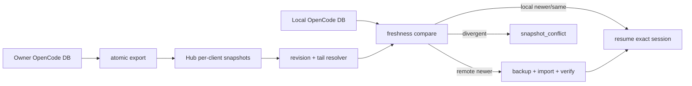

# v0.4.49 PRD — 运行时修复与 Session 快照收敛

> 父版本：v0.4.48.post6
> 起草日期：2026-09-02
> 封板日期：2026-09-07
> 类型：API 版（用户明确要求将已完成修复发布，作为奇数版发布例外）
> 范围来源：跨 Client resume、trigger workdir 与 freeze runtime 现场问题

## 0. 一句话目标

让跨机器恢复时的 conversation snapshot、trigger 工作目录和 bullet runtime 绑定以可验证证据收敛，并把已完成修复交付为可由 `dt upgrade` 安装的 v0.4.49。

## 1. 范围与不变量

### 1.1 In-scope

- `dt pull` 同步 tunnel/entry 之外，同时同步 OpenCode 与 tmux persist 数据；传输失败显式返回。
- snapshot resolver 按 payload revision 与尾消息判断新鲜度，不按文件 mtime 或“相同 session ID 已存在”直接跳过。
- 本地旧 revision 在导入前备份；导入后验证尾消息；本地较新时禁止降级；同 revision 分叉时 `snapshot_conflict` fail closed。
- 普通 `dt enter` 在 discover/attach 前把 trigger tmux 收敛到专属 `~/.dual-tmux/ops/<op>`；已有前台 Agent 时不注入 `cd`。
- freeze 以实时 SSH/交互式 docker 进程为最高优先级，候选 runtime 仅在远端 Agent/session 探测成功后提交。
- partial freeze 保存已验证 side，但命令返回非零并记录 `freeze.fail`。
- trigger 套件补充进展证据、模型梯级和 Client 失联恢复约定。
- 累积包含 v0.4.48.post3～post6 已发布的状态栏、cron PATH、bullet fencing 和 trigger snapshot export 修复。

### 1.2 Out-of-scope

- Lease v2、owner request/ack handoff、四维 semantic activity、通用 transactional resume 和 `dt ownership` 尚未实现，不计入 v0.4.49 发布验收。
- 上述 Session Ownership API 保留在 `BL-RUNTIME-001`，重新排入后续奇数 API 版本；其 Web 消费版本在 API 冻结后再立项。
- Web 大规模改版、项目级 Agent 套件、交接区、自适应轮询和自动中断 stalled Agent。

### 1.3 不变量

- 一个 deployment 只有一个总 PersonalAgent；飞书凭据只以 AEAD 密文落盘。
- 运行时数据不进入 Git；升级前后 config 与 tunnel 内容哈希不变。
- 无法验证 snapshot 祖先关系、远端 Agent 或 runtime 时 fail closed。
- freeze 的候选证据不得在验证前覆盖已有权威 binding。
- 本地已更新 conversation 不被旧 Hub snapshot 反向降级。
- trigger 空闲 shell可纠正目录，正在运行的 Agent/前台程序不接收隐式命令。

## 2. 数据收敛

binding 与 conversation snapshot 是两条独立数据链。`dt pull` 必须先完成 persist 传输；resume 再选择最新的完整 snapshot，并验证实际导入结果。

## 3. 工作点与 freeze 权威

- Trigger：项目操作目录固定为 `ops/<op>`。新 tmux 直接以该目录创建；只有空闲 shell 才可安全纠正 cwd。
- Bullet：实时进程链优先于 pane scrollback。`docker exec` token 不能被误识别为 SSH server。
- 提交：只有远端 client/session 探测成功后，才原子更新 runtime、run_point 和 side binding。
- 失败：请求的任一 side 未完成即返回失败；已验证 side 可以持久化，但不得记录整体 `freeze.ok`。

## 4. 真实环境证据

- 2026-09-05：Home 从 OUC snapshot 恢复 `dt-company_intro_v2` trigger 的 1052 条消息，尾消息校验一致。
- 2026-09-06：`dt-cp-gate` 普通 enter 后 pane 与 `op_point.cwd` 均落在专属 ops 目录。
- 2026-09-06：`dt-cp-gate` 从 live `ssh root@10.88.0.20` 与 `cp_gateway_24629` 取证，freeze 到 session `ses_f8a384577ffeb75HokVSq3nf13`。

## 5. 风险登记表

| ID | 风险 | 缓解 | 严重度 |
|---|---|---|---|
| R1 | 同 ID 的旧 snapshot 被误认为最新 | revision、tail 与祖先关系比较；导入后验证 | critical |
| R2 | 多源 snapshot 分叉被静默覆盖 | `snapshot_conflict` fail closed并保留双方 | high |
| R3 | scrollback 污染 runtime | 实时进程优先；远端 session 验证后提交 | high |
| R4 | enter 向运行中的 Agent 注入 `cd` | 只纠正空闲 shell | high |
| R5 | 规划范围大于实际交付 | 封板时移出未实现 Ownership API，不伪造验收 | high |

## 6. 签名

`Agent-PM-0.4.49-final`
