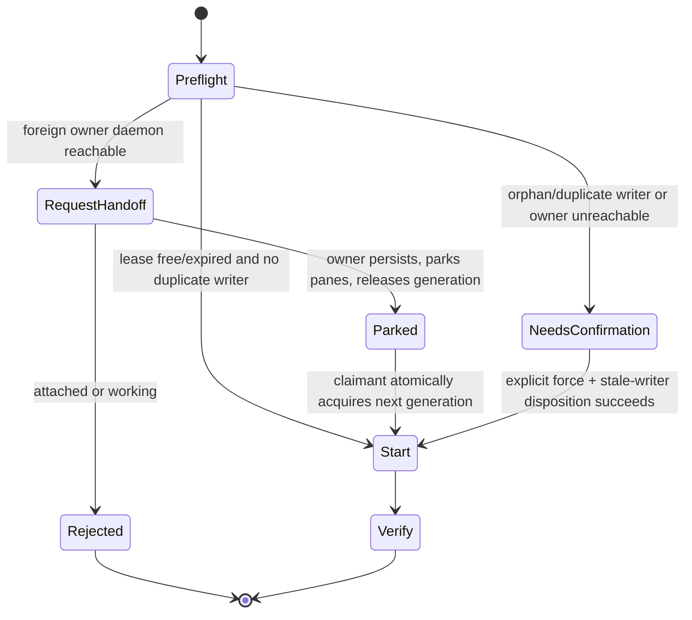
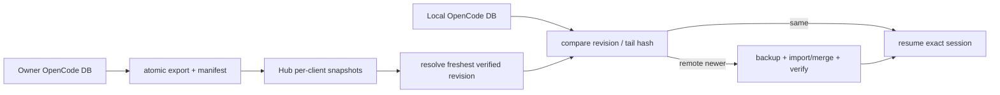

# v0.4.49 PRD — 运行时修复与 Session Ownership API

> 父版本：v0.4.48.post4（当前规划基线；v0.4.49 最初从 post2 开线）
> 起草日期：2026-09-02
> 类型：API 版（奇数，默认不单独发布；纯 hotfix 不受奇偶约束，可破例走 post 发布）
> 范围来源：用户口述问题清单；2026-09-02 `dt-company_intro_v2` 跨 Client resume 现场
> 架构决策：[[decision-lease-activity-separation]]

## 0. 一句话目标

集中修复 v0.4.48 发布后发现的问题，并建立“租约不等于活动、活动不等于进展、session 只能有一个 writer”的 ownership API，为 v0.4.50 Web 交互提供可靠事实源。

## 1. 范围与不变量

### 1.1 In-scope

- 用户口述的 hotfix 问题清单（见第 3 节，逐条追加，每条对应 `hotfix/v0.4.49-*` 分支）。
- 语义活动采样：剥离 TUI chrome，分别记录 owner heartbeat、pane 存活、用户 attached、turn phase 和有效进展。
- Lease v2：租约只表达写权限，generation 用于 fencing；不得把锁屏后台 tick 描述为用户活跃。
- 安全接管：支持 owner daemon 的 request/ack handoff；无法 ack 时必须给出可解释状态，不静默抢占。
- 事务化 resume：所有权、远端入口、目标 session 和重复进程检查全部 preflight 成功后，才改变本地 tmux。
- Session writer 单活：相同 session ID 已有 writer 时禁止再启动第二个进程；孤儿进程只能经显式确认处置。
- Session snapshot 收敛：内建 export/sync，按 session revision/更新时间/尾消息 hash 比较本地与各 Client 快照；ID 相同但内容陈旧时不得跳过导入。
- Persist identity 必须与 `config.client` 一致；`dt pull/resume` 的 preflight 必须报告 tunnel binding 与 conversation snapshot 是两条不同数据链。
- CLI/JSON 诊断合同，为 v0.4.50 Web 消费。

### 1.2 Out-of-scope

- Backlog 中的新功能（项目级 Agent 套件、Web 交接区、自适应轮询等）不在本版，归 v0.4.50+。
- Web 大规模改版、接管弹窗和状态可视化，进入 v0.4.50。
- 自动中断 working/stalled Agent；本版只检测、阻止继续堆队列并请求人工决策。
- 以屏幕锁定状态作为接管依据；它不可靠且不等价于 session 空闲。

### 1.3 不变量（继承 v0.4.48）

- 一个 deployment 只有一个总 PersonalAgent；凭据仅以 AEAD 密文落盘。
- local/Hub WS 单活租约 + generation fencing；旧 generation fail-closed。
- 运行时数据不在 git 追踪中。
- 升级路径不降级；config/tunnel 哈希在升级前后不变。
- 每个 hotfix：commit message 标注 `hotfix`，附简要测试验证，不混入功能开发。
- lease freshness 只证明 owner daemon 存活，不证明用户活跃或 pane 正在产生有效进展。
- 未取得目标 generation 前不得向 pane 或 session 发送输入。
- preflight 失败不得删除、重建或重连本地 tmux；后台 fencing 必须是独立、可审计事件。
- 同一 OpenCode/Codex/Claude session ID 同时最多一个可写进程。
- “session ID 存在”不等于“本地 session 内容最新”；resume 必须证明目标 revision 已落地。
- snapshot 同步不能只 rsync 一个假定由外部工具生成的空目录；export 成功是 publish 的前置条件。
- 无法证明安全时 fail closed，并给出 holder、lease age、attached、phase、last progress 和样本覆盖窗口。

## 2. 工作方式

```
main (v0.4.48.post4)
  └── hotfix/v0.4.49-<issue-slug>   ← 每个问题一个分支（L3）
        → 本地测试验证 → PR → 合并 main
  └── feature/v0.4.49-session-ownership
        → activity semantics → lease v2 → transactional resume → diagnostics
```

- Git 权限模式：`pm-maintainer`（门禁全过后经 PR 合并保留审计记录）。
- 全部 hotfix 合并后：跑全量 pytest 回归，更新 pm-state.md，再决定发布形式。

## 3. Hotfix 清单

| # | 分支 | 问题 | 状态 |
|---|------|------|------|
| 1 | hotfix/v0.4.49-tmux-sync-status | 终端 tmux 状态栏无同步状态提示（同步链路本身健康，属可视化缺口） | MERGED (PR #18) |
| 2 | hotfix/v0.4.49-tick-cron-path | cron 裸 PATH 无 homebrew，`dt tick` 每分钟 FileNotFoundError: tmux 崩溃（14292 次 start 仅 10 次完成），错误被 `>/dev/null` 吞掉 | MERGED (PR #20) |

## 4. Session Ownership 状态机

### 4.1 四个正交事实

| 维度 | 示例状态 | 含义 |
|---|---|---|
| owner lease | free / held / expired | 哪个 Client 当前具有写权限 |
| runtime | down / shell / agent | tmux、跳板与 Agent 进程是否存在 |
| interaction | detached / attached | 是否有用户正连接 pane |
| progress | idle / working / stalled / unknown | turn 是否有剥离 chrome 后的有效增量 |

不得从其中一个维度推断另一个维度。锁屏机器可能 `held + agent + detached + idle`；这不是用户活跃，也不是 owner 失联。

### 4.2 Lease v2 记录

```json
{
  "holder": "tm_ouc",
  "generation": 7,
  "renewed_at": 1788361508,
  "instance_id": "daemon-uuid",
  "handoff": {"requested_by": "tm_andy_home", "requested_at": 0},
  "evidence": {
    "attached": false,
    "phase": "idle",
    "last_semantic_change_at": 1788359466,
    "sample_count": 30,
    "window_seconds": 1800
  }
}
```

旧 `holder@timestamp@generation` 记录必须可读，并在 owner 下一次续租时原子升级；不做破坏性批量迁移。

### 4.3 接管协议



- 普通 `dt resume`：只做安全接管；任何不确定性均无副作用失败。
- `--force`：不是跳过检查，而是允许进入显式 stale-writer 处置流程；仍须保证最终只有一个 writer。
- owner 收到 handoff 后先持久化/freeze，再 park 本地 pane，最后释放 lease；claimant 取得新 generation 后才能启动。
- 旧 generation 的 daemon、mailbox 和自动恢复动作全部 fail closed。

### 4.4 Resume 两阶段事务

1. **Plan/preflight**：解析 binding，读取 lease/evidence，探测本地与远端 session writer，验证 persist/DB 和入口。
2. **Commit**：取得 generation，按 side 启动或复用唯一 writer，验证 session ID 与 cwd。
3. **Rollback**：启动失败时释放新 generation；保留原 pane/快照，不把半完成状态发布到 Hub。

`require_active()` 不再在 claim 异常路径里隐式 `drop_local()`。需要 fencing 时产生独立 `ownership.fence` 事件并保留诊断快照。

### 4.5 CLI/JSON 合同

- `dt ownership <name> [--json]`：输出 holder、generation、lease age、attached、phase、last progress、sample window 和每侧 writer。
- `dt resume <name> --plan`：只输出将执行的接管/启动动作。
- `dt resume <name>`：安全路径；支持 daemon handoff。
- `dt resume <name> --force`：要求确认并明确 stale writer 如何处理，不允许静默启动重复 session。
- 所有拒绝信息区分 `busy`、`attached`、`insufficient_evidence`、`owner_unreachable`、`duplicate_writer`，禁止统一写成 “last 30 ticks still changing”。

### 4.6 Session snapshot 收敛

跨 Client resume 需要同时恢复 binding 和 conversation，两者不能再由用户隐式拼接：



- daemon/tick 在 owner Client 内建导出活跃 trigger session；生成脚本不能只 rsync 空的 `~/sessions/opencode/<client>`。
- manifest 至少包含 session ID、source Client、exported_at、session updated_at、最后 message ID/hash、内容 hash 和 schema version。
- resolver 按同一 session ID 选择最新完整快照，不按 slug 或文件 mtime 猜测；source identity 必须与 `config.client` 一致。
- `ensure_local()` 必须从“存在即跳过”改为 freshness compare；本地旧 revision 先备份，再导入/合并并验证尾消息。
- `dt pull` 增加可观测的 persist 同步阶段，或提供默认开启的 `--with-persist`；resume plan 显示 binding revision 与 snapshot revision。
- 多源 revision 分叉时不得静默 last-write-wins，返回 `snapshot_conflict` 并保留双方证据。

## 5. 与 v0.4.50 的关系

v0.4.49 只交付可靠 API、CLI 与事件合同，不做大规模 Web 改动。v0.4.50 直接消费 ownership JSON 和 handoff 操作，不在前端重新猜测状态。

## 6. 风险登记表

| ID | 风险 | 缓解 | 严重度 |
|----|------|------|--------|
| R1 | hotfix 触及飞书/升级等已验证路径引入回归 | 每个 hotfix 独立分支 + 相关测试全跑 + 合并前全量回归 | medium |
| R2 | 多个 hotfix 并行改同一文件产生冲突 | 按序合并，后一个 rebase 到最新 main | low |
| R3 | 把“无输出”误判为空闲并接管真实长任务 | progress 与 attached/lease 分离；working/stalled 不自动中断；handoff 由 owner ack | high |
| R4 | 同一 session 多进程并发写坏历史 | 启动前 writer probe；generation fencing；duplicate_writer fail closed | critical |
| R5 | preflight 失败导致本地 pane 被删除 | 两阶段 resume；异常路径零副作用；故障注入测试 | high |
| R6 | Lease v2 让旧 Client 无法工作 | 向后兼容读取 v1；owner 续租时惰性升级；混合版本 E2E | high |
| R7 | 同 ID 的旧 trigger 被误认为已恢复 | revision/tail hash 比较；导入后验证；真实 OUC→Home E2E | critical |
| R8 | 多 Client 同时导出造成 snapshot 分叉 | generation/source manifest；冲突 fail closed；不覆盖原快照 | high |
