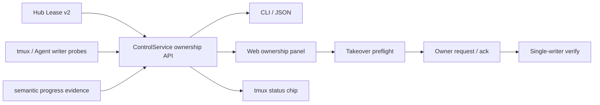

# v0.4.50 PRD — Ownership 与安全接管 Web 版

> 父版本：v0.4.49-final
> 起草日期：2026-09-02
> 类型：Web 版（偶数，完整封板后发布）
> 范围来源：v0.4.49 Session Ownership API；`dt-company_intro_v2` 跨 Client resume 事故
> 架构决策：[[decision-lease-activity-separation]]

## 0. 一句话目标

让用户在 Web 和终端中准确看见“谁持有、是否有人连接、Agent 是否在工作、最后有效进展、能否安全接管”，并通过可审计 handoff 完成跨 Client 恢复。

## 1. 范围与不变量

### 1.1 In-scope

- Tunnel 列表和详情展示 owner lease、runtime、attached、progress 四维状态。
- 显示 holder、lease age、最后有效进展、样本数/窗口和 session writer 数。
- 显示 trigger/bullet snapshot 的 source Client、revision、最后同步时间和 freshness/conflict。
- 安全接管向导：预检、向 owner 请求 handoff、等待 ack、接管、验证。
- `busy`、`attached`、`insufficient_evidence`、`owner_unreachable`、`duplicate_writer` 分场景提示。
- 高风险 force 流程要求输入 tunnel 名确认，并明确 stale writer 处置方案。
- Web、CLI 和 tmux status chip 使用同一 ownership API，不在各端重新推断。
- Browser E2E 覆盖双 Client、锁屏后台 heartbeat、重复 writer 和断网恢复。

### 1.2 Out-of-scope

- 修改 Lease v2 或 resume 协议；协议在 v0.4.49 完成并冻结。
- 自动终止 stalled Agent 或重复 writer。
- BL-WEB-001～004 的完整交接区、500 行 terminal、自适应轮询和摘要重构；可共享底座但另行排期。

### 1.3 不变量

- UI 不把 lease heartbeat 标成“用户活跃”。
- UI 不用 pane spinner、固定 tick 数或页面内存推断完成/空闲。
- 所有 destructive takeover 必须由 ControlService 预检和确认，浏览器不能直接拼 shell。
- 页面刷新、切换 tab 或 Web 重启不丢 handoff transaction。
- 同一 session ID 最多一个 writer；检测到冲突时默认禁止 resume。
- 运行时数据、lease、handoff transaction 和 session 快照不进入 Git。

### 1.4 与历史版本的关系

- v0.4.48 提供 Web 控制面和 durable Web turn。
- v0.4.49 提供 ownership、handoff、semantic progress 和 transactional resume API。
- v0.4.50 只负责消费这些事实并完成用户交互与正式发布。

## 2. 顶层蓝图

## 3. Ownership 状态展示

每条 tunnel 固定展示四个独立字段，不合成模糊的单一绿/黄/红：

| 字段 | 展示示例 |
|---|---|
| 所有权 | `tm_ouc · lease 98s · generation 7` |
| 运行态 | `trigger agent / bullet shell` |
| 连接态 | `无人 attached` |
| 进展态 | `idle · 37m 无有效变化 · 30 samples / 4h14m` |
| 会话快照 | `trigger: tm_ouc · rev 18:26 · 已同步 / bullet: remote DB · rev 18:28` |

聚合状态只用于排序，详情始终展示原始证据。`unknown`/`insufficient_evidence` 不得伪装成 busy。

## 4. 安全接管向导

1. 用户点击“接管”，Web 请求 `resume plan`。
2. 展示当前 owner、连接/进展证据、目标 session 和已发现 writer。
2.1 展示 binding 与 conversation snapshot 的 revision；旧 snapshot 或 conflict 时先修复同步，不进入启动阶段。
3. owner daemon 可达时，发送 handoff request，并实时展示 persist/park/release/claim/start/verify 阶段。
4. owner 拒绝或仍在 working/attached 时终止，不改变本地 pane。
5. owner 不可达或发现 duplicate writer 时进入高风险确认，不默认选中 force。
6. 成功后显示新 generation 和两侧实际 session ID；失败显示回滚结果。

## 5. tmux 与 CLI 一致性

- status chip 至少区分 `owned`、`foreign`、`handoff`、`fenced`、`conflict`。
- Web、`dt ownership --json`、`dt inspect` 和 chip 的 holder/generation 必须来自同一快照。
- 任何端执行接管后，其他端在一个 heartbeat 周期内收敛。

## 6. 不变量自验

- Browser 中模拟锁屏 heartbeat：显示 owner online + detached + idle，不显示 active/busy。
- claim 拒绝后，前后 tmux session 集合和 binding hash 相同。
- duplicate writer 场景中点击普通/force 接管均不得静默创建第三个进程。
- 页面刷新后 handoff 阶段和审计 ID 保持一致。
- `git ls-files data/ | wc -l == 0`。

## 7. 风险登记表

| ID | 风险 | 缓解 | 严重度 | 责任人 |
|---|---|---|---|---|
| R1 | UI 聚合状态掩盖四维事实 | 详情固定展示原始 evidence；契约测试 | high | Coder + Tester |
| R2 | 用户误点 force 终止有效任务 | 默认安全 handoff；二次确认；不默认选择 stale writer 动作 | critical | PM + Coder |
| R3 | 页面刷新重复提交 handoff | durable transaction ID + 幂等 API | high | Coder |
| R4 | Web 与 CLI/chip 状态漂移 | 单一 ControlService snapshot + 跨端 E2E | medium | Tester |
| R5 | 新 UI 影响既有 durable turn | 全量 Web 回归与真实 dt-portal/dt-company_intro_v2 E2E | high | Tester |

## 8. 签名

`Agent-PM-0.4.50-draft`
