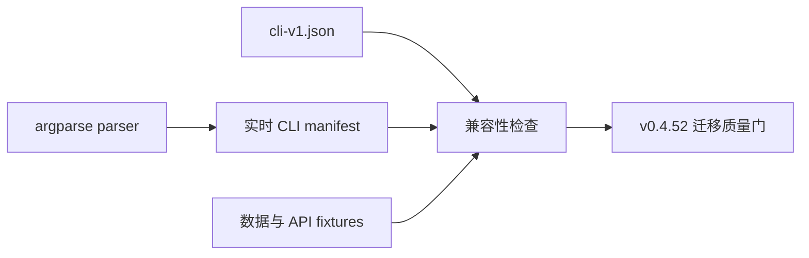

# v0.4.51 PRD — CLI 基线与版本化契约

> 父版本：v0.4.50-final（待 v0.4.49 hotfix 收尾及 v0.4.50 封板后创建）
> 起草日期：2026-09-08
> 类型：API 版（奇数，默认不单独发布）
> 范围来源：根目录 `ROADMAP.md` 演进一

## 0. 一句话目标

在不改变、不删减现有 CLI 能力的前提下，把 CLI 语法、数据格式、操作结果和错误语义固化为可自动验证的版本化契约，为后续 Web 框架和共享操作内核迁移建立防退化基线。

## 1. 范围与不变量

### 1.1 In-scope

- 全量 CLI command manifest：一级/嵌套命令、参数、默认值、choices。
- argparse parser 与版本化快照的一致性测试。
- CLI 命令 dispatch、核心生命周期和 local/Hub 基线测试。
- Web API、ControlResult、错误码和持久化 fixture 的契约盘点。
- 已知偶发问题的分类、最小复现和回归入口。

### 1.2 Out-of-scope

- FastAPI/React 工程落地，进入 v0.4.52。
- 从 `cli.py` 大规模下沉业务实现，进入 v0.4.53。
- Operation Runtime、SSE 和跨进程锁，进入 v0.4.55。
- 改变任何现有 CLI 命令的核心含义。

### 1.3 不变量

- `docs/contracts/cli-v1.json` 覆盖的命令能力不得减少。
- 现有 config、tunnel、entry、health、memory 和 persist 数据可原地读取。
- local-only 与 Hub 两种模式都保持完整可用。
- OpenCode、Codex、Claude Code 的现有 capability 不退化。
- Web 资源或依赖失败不影响 CLI 启动。
- 运行时数据不进入 Git。
- 新契约测试用于发现变化，不能通过无评审更新快照来绕过。

### 1.4 与历史版本的关系

`v0.4.49` 是独立 hotfix 合集，不承载本次架构演进。当前工作树中先放入的 CLI 契约护栏是预备成果；正式开发分支必须从 `v0.4.50-final` 创建，并重新执行全量验证。

## 2. 顶层蓝图

## 3. Feature A：CLI 语法契约

- 新增 `dual_tmux.cli_contract`，只负责从 parser 生成 JSON-safe manifest。
- 保存 `docs/contracts/cli-v1.json`。
- 测试实时 parser 与快照完全一致。
- 公开变更必须显式更新契约；破坏性变化必须使用新 schema/version。

## 4. Feature B：CLI dispatch 与生命周期基线

- 覆盖无子命令默认行为、配置前置检查和 handler dispatch。
- 覆盖 `new → freeze → drop → resume` 的 local/Hub 主链。
- 外部依赖通过 tmux/SSH/file gateway fixture 替换，不访问真实用户运行时数据。

## 5. Feature C：API、结果与数据契约

- 记录现有 Web API 方法/路径/读写风险。
- 稳定 `ControlResult` 和 `ControlError` 的最小机器字段。
- 为 config/tunnel/entry/health/memory/web-state 保存版本化 fixture。
- 登记 GET 中的隐式副作用并建立迁移测试。

## 6. Feature D：偶发问题回归机制

- 按并发、探测、部分写入、超时、环境差异分类已有 cases。
- 每类至少形成一个自动化回归或明确的故障注入入口。
- 事件中能够关联一次命令/操作，为后续 operation ID 铺路。

## 7. 验收与风险

### 验收

- CLI v1 manifest 与 parser 一致。
- 所有一级和嵌套命令被覆盖。
- 当前全量 pytest 通过。
- 旧数据 fixture 可读取。
- CLI 人类交互和默认行为无退化。

### 风险登记表

| ID | 风险 | 缓解 | 严重度 | 责任人 |
|---|---|---|---|---|
| R1 | 快照测试变成机械更新 | PR 必须说明契约差异和兼容策略 | high | PM/Coder |
| R2 | argparse 私有类型跨 Python 漂移 | manifest 只记录稳定语义并在 3.10+ 验证 | medium | Coder |
| R3 | 基线测试固化真实 bug | 明确标记 compatibility 与 bug regression | medium | Tester |
| R4 | 与 v0.4.49 hotfix 混杂 | 正式分支从 v0.4.50-final 创建 | high | PM |

## 8. 签名

签名：Agent-PM-0.4.51
