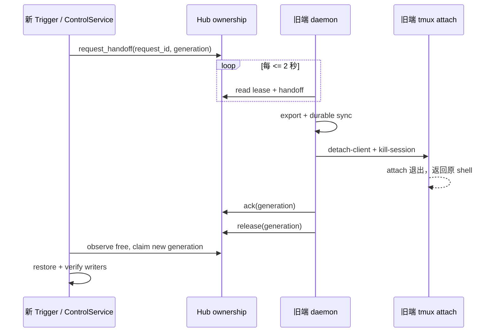

# v0.4.55 PRD — Trigger 独热接管协议

> 父版本：v0.4.54.post3（318fe84）  
> 起草日期：2026-09-08  
> 类型：API 版（奇数）  
> 范围来源：用户确认的多端单活动 Trigger 体验

## 0. 一句话目标

把“谁能操作 Trigger”从最终一致的 owner 标记，收敛为可测的独热协议：健康环境中，新端显式接管后 10 秒内可输入；旧端先持久化，再被 detach/kill，前台 `tmux attach` 返回原 shell。

## 1. 范围与不变量

### 1.1 In-scope

- 常驻 daemon 以 2 秒轻量 watchdog 响应 handoff 和检查 ownership fence；完整事实缓存保持 15 秒周期。
- 保持 `persist → park(detach + kill) → ack → release → claim → restore` 顺序。
- claimant 使用单一总时限等待明确 release，不再固定等待 65 秒。
- 旧 owner 一旦观察到更高 generation/外部 holder，必须立即 park 本地两侧 tmux。
- 用单调时钟测试 10 秒预算，用真实前台 tmux Client 测试旧端回到 shell。

### 1.2 Out-of-scope

- v0.4.55 不重做 Web 页面；Web 继续复用同一 ControlService。
- 不承诺在旧机器关机、网络隔离或 daemon 死亡时远程杀掉其本地 tmux；这是物理上不可确认的故障域。此时新端 fail-closed，不宣称“已安全接管”。
- 不删除或改写 tunnel binding、session snapshot、Memory 或运行时数据。

### 1.3 不变量

- CLI 已有命令、参数和行为不阉割。
- CLI、Web、飞书的变更操作共享同一个 ownership/generation 内核；只读操作不 claim。
- Hub 锁和 generation 是写权限权威；旧 generation 的 release/ack/写操作无副作用。
- 旧端退出仅销毁本地运行载体，不删除冻结绑定与持久化 session。
- 运行时数据不进入 Git；所有新增行为由自动化测试覆盖。

### 1.4 与历史版本的关系

v0.4.51 建立 Lease v2，v0.4.53 建立 native persist，v0.4.54 提供 Web ownership 面板；v0.4.54.post3 恢复锁驱动接管，但仍存在 5 秒 handoff 后固定等待 65 秒的路径。本版只收紧协议时序与 fencing，不另起第二套 CLI/Web 实现。

## 2. 顶层时序

## 3. SLA 与失败语义

- `ownership_interval = 2s`，handoff 获取总预算 `10s`。
- 协作接管只有观察到 `free/expired` 并成功 claim 才进入 restore。
- 10 秒内未完成 persist/park/release：返回明确超时，保持旧 owner；不得先开放新端再等待旧端退出。
- Hub 不可达、generation 冲突、附件探针未知或持久化失败均 fail-closed。
- daemon 观察到外部 holder 时执行本地 fence；它不需要等 minute tick。

## 4. 风险登记表

| ID | 严重度 | 风险 | 缓解措施 | 责任人 |
|---|---|---|---|---|
| R1 | high | 持久化超过 10 秒 | 超时拒绝新端 restore，旧端保持权威并给出可重试错误 | Coder |
| R2 | high | 旧 daemon 不存活，无法让其前台 tmux 返回 shell | 不伪造 kick 成功；健康检查与 E2E 把 daemon 作为 SLA 前提 | Coder/Tester |
| R3 | high | 旧 generation 晚到的 ack/release 破坏新 owner | Hub 端 generation + instance fencing，增加无副作用测试 | Coder |
| R4 | medium | 2 秒巡检增加 Hub SSH 压力 | worker 串行、只读快照缓存、后续可迁移成长连接；本版测量资源占用 | Coder |
| R5 | high | 误删 session 数据 | park 只 detach/kill tmux；binding/persist/native store 纳入回归 | Tester |

## 5. 签名

Agent-PM-0.4.55
