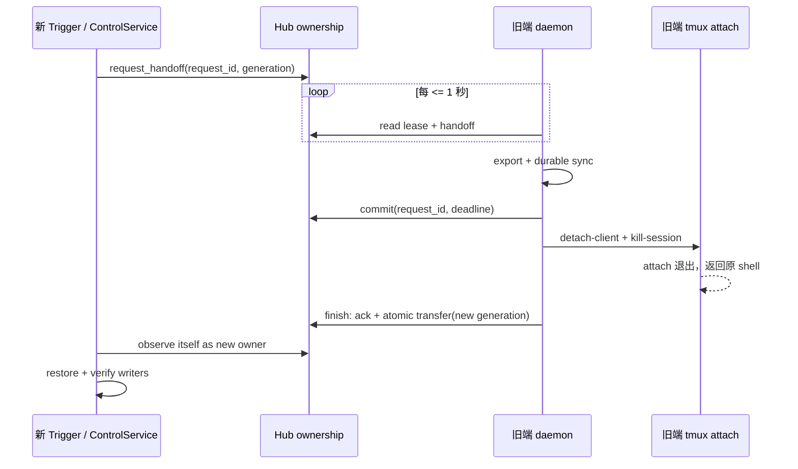
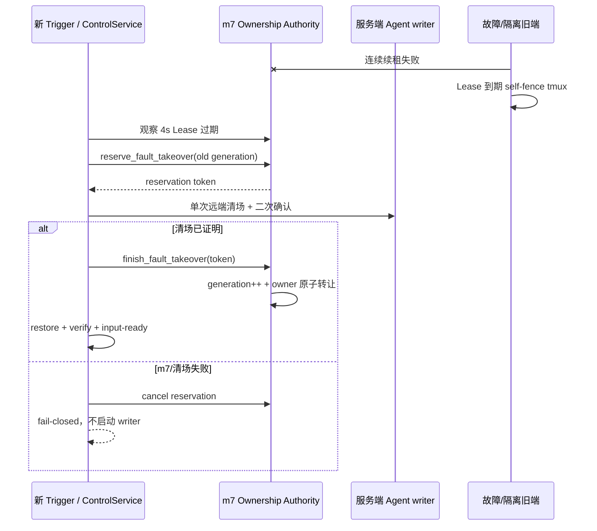

# v0.4.55 PRD — Trigger 独热接管协议

> 父版本：v0.4.54.post3（318fe84）  
> 起草日期：2026-09-08  
> 类型：API 版（奇数）  
> 范围来源：用户确认的多端单活动 Trigger 体验
> 发布策略：独热与故障接管属于跨 Client 必须同时升级的安全能力，经用户明确授权，作为奇数 API 版例外发布

## 0. 一句话目标

把“谁能操作 Trigger”从最终一致的 owner 标记，收敛为 Hub 服务模式下可测的独热协议：健康交接与故障接管均以 m7 的 generation 为唯一权威，新端 10 秒内可输入；健康旧端先持久化，再被 detach/kill，前台 `tmux attach` 返回原 shell。

## 1. 范围与不变量

### 1.1 In-scope

- 常驻 daemon 以 1 秒轻量 watchdog 响应 handoff、续租和检查 ownership fence；完整事实缓存保持 15 秒周期。
- 保持 `persist → commit → park(detach + kill) → atomic transfer → restore` 顺序。
- claimant 使用单一总时限等待明确的原子 transfer，不再固定等待 65 秒。
- 旧 owner 一旦观察到更高 generation/外部 holder，必须立即 park 本地两侧 tmux。
- `committing` 是可重入恢复点；daemon 重启或瞬时写失败后继续 park + transfer。
- v2 handoff 使用显式协议状态；新旧版本混跑时在 park 前拒绝，避免旧协议绕过 deadline/cancel。
- 用单调时钟测试 10 秒预算，用真实前台 tmux Client 测试旧端回到 shell。
- Hub 模式的 owner 使用 4 秒 Lease v2，daemon 每 1 秒续租；旧 sidecar/无 sidecar 仍按 300 秒解释，避免滚动升级时误判。
- owner 失联后，新端先在 m7 预留 fault takeover，再由服务端一次远端动作清理并二次确认旧 writer 消失，最后由 m7 原子签发新 generation。
- m7 不可达、预留冲突或服务端清场无法证明成功时 fail-closed；旧 generation 恢复后只能 self-fence，不能自动复活。

### 1.2 Out-of-scope

- v0.4.55 不重做 Web 页面；Web 继续复用同一 ControlService。
- m7 不能改变一台完全离线机器的本地屏幕；但会撤销旧 generation、清理可达的服务端 writer，并阻止旧端恢复业务能力。故障端恢复联网后必须先校验 generation，再退出旧 tmux 回到 shell。
- 不删除或改写 tunnel binding、session snapshot、Memory 或运行时数据。

### 1.3 不变量

- CLI 已有命令、参数和行为不阉割。
- CLI、Web、飞书的变更操作共享同一个 ownership/generation 内核；只读操作不 claim。
- Hub 锁和 generation 是写权限权威；旧 generation 的 release/ack/写操作无副作用。
- 旧端退出仅销毁本地运行载体，不删除冻结绑定与持久化 session。
- 运行时数据不进入 Git；所有新增行为由自动化测试覆盖。

### 1.4 与历史版本的关系

v0.4.51 建立 Lease v2，v0.4.53 建立 native persist，v0.4.54 提供 Web ownership 面板；v0.4.54.post3 恢复锁驱动接管，但仍存在 5 秒 handoff 后固定等待 65 秒的路径。本版只收紧协议时序与 fencing，不另起第二套 CLI/Web 实现。

## 2. 顶层时序

## 3. SLA 与失败语义

- `ownership_interval = 1s`，handoff 获取总预算 `10s`。
- 协作接管只有观察到 Hub 已原子转让给自己的新 generation 才进入 restore；无可抢占的 `free` 窗口。
- 10 秒内未完成 persist/commit/park/transfer：返回明确超时；cancel 胜出时保持旧 owner，不得先开放新端再等待旧端退出。
- claimant 超时 cancel 与 owner commit 在同一 Hub 锁内竞争；cancel 赢则旧端不 park，commit 赢则 owner 必须完成 park + transfer。
- commit 后事务可由后续 daemon tick 重入完成；不会因最后一次 Hub RPC 失败卡到 300 秒 Lease 过期。
- v0.4.54 与 v0.4.55 混跑不执行接管：双方均保留当前 owner 并提示升级；两端升级后恢复 10 秒 SLA。
- Hub 不可达、generation 冲突、附件探针未知或持久化失败均 fail-closed。
- daemon 观察到外部 holder 时执行本地 fence；它不需要等 minute tick。
- 4 秒 Lease 为故障接管预留约 6 秒清场与恢复预算；健康 handoff 的持久化阶段由独立 keepalive 续租，避免长 persist 被误判成故障。
- fault takeover 的 commit 可重入：若 sidecar 已提交而 legacy lock 尚未发布，使用同一 reservation 重试会修复 lock；竞争 claimant 和 stale generation 无副作用。

## 4. 风险登记表

| ID | 严重度 | 风险 | 缓解措施 | 责任人 |
|---|---|---|---|---|
| R1 | high | 持久化超过 10 秒 | 超时拒绝新端 restore，旧端保持权威并给出可重试错误 | Coder |
| R2 | high | 故障端完全离线，m7 无法改变其物理屏幕 | m7 撤销 generation/清服务 writer；恢复端先校验再 self-fence；文档不伪造物理退出 | Coder/Tester |
| R3 | high | 旧 generation 晚到的 ack/release 破坏新 owner | Hub 端 generation + instance fencing；finish 原子转让，增加无副作用测试 | Coder |
| R4 | medium | 1 秒活动端巡检增加 Hub SSH 压力 | 仅 live tunnel 进入快循环，worker 串行、全量快照仍 15 秒；后续可迁移成长连接 | Coder |
| R5 | high | 误删 session 数据 | park 只 detach/kill tmux；binding/persist/native store 纳入回归 | Tester |
| R6 | high | 滚动升级期间旧协议破坏 deadline/cancel | v2 使用旧 daemon 不识别的状态；新 daemon 在 park 前拒绝 legacy 请求 | Coder/Tester |
| R7 | high | 清场与 claim 分离导致第三端插队或误杀新 writer | m7 reservation 先行，finish 在 flock 下校验 claimant/instance/generation 并原子转让 | Coder/Tester |

## 5. 签名

Agent-PM-0.4.55
