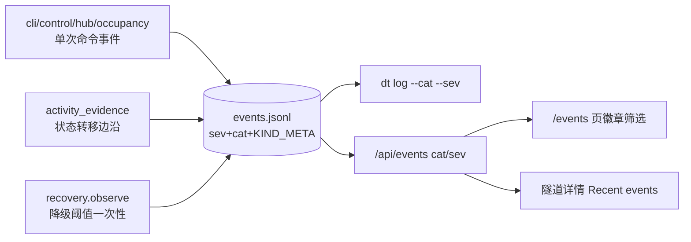

# v0.4.75 PRD — 事件体系（Event Management）

> 父版本：main @ 2ab0eda（v0.4.74 发布后）
> 起草日期：2026-09-15
> 类型：功能版（事件模型 v2，向后兼容）
> 范围来源：用户需求「事件管理」+ ROADMAP S11

## 0. 一句话目标

把 `events.jsonl` 从零散审计日志升级为带分类/严重度/中文标签的结构化事件体系，补齐管道建立、模型替换、命令 Bullet、Trigger 回合、Bullet 运行等缺失采集点，让用户完整理解隧道与 Agent 生命周期并辅助运维。

## 1. 范围与不变量

### 1.1 In-scope

- 事件模型 v2：`sev`（info/warn/error）、`cat`（system/trigger/bullet）、`KIND_META` 注册表、fallback 派生规则、2 万行保留上限。
- system 层缺口：`transport.reconnect(.ok/.fail)`、`transport.reconcile`、`dt.model.ok/.fail`、`hub.occupancy` 附接管 reason。
- trigger 层新增：`trigger.send`、`bullet.send`（命令 Bullet）、`*.interrupt`、`trigger.turn.start/.end`、`trigger.stalled`、`trigger.start.ok/.fail`。
- bullet 层新增：`bullet.start.ok/.fail`、`bullet.run.start/.end`、`bullet.stalled`、`bullet.fence`、`bullet.probe.fail`。
- 展示：`dt log --cat/--sev` 与中文标签着色；Web `/events` 页表格化（徽章 + 筛选）；`/api/events` 增 cat/sev 参数并补全旧行派生字段；隧道详情 Recent events。

### 1.2 Out-of-scope

- 事件跨机汇聚（hub 同步 append-only 多写者合并）→ 后续版本。
- 事件驱动的自动化动作（告警外发等）。
- 猜测性任务成败判定（保持可观察事实口径）。

### 1.3 不变量

- 旧 `events.jsonl` 行必须可读；`dt log` 旧参数不减少。
- 事件留本机，不进 hub push/pull。
- 不记录 prompt 全文（preview ≤60 字符 + 长度）。
- tick/daemon 周期路径不产生重复事件（边沿触发 + 阈值一次性）。
- Web 资源故障不影响 CLI。

## 2. 顶层蓝图

## 3. 噪音控制设计

- `activity_evidence` 只在持久化 evidence 上一状态 ≠ 新状态时发射 turn/run 事件；tick 与 daemon 共用去重。
- `recovery.observe` 仅在 `consecutive_failures` 首达 `FAIL_THRESHOLD`(3) 时发射 probe.fail，健康后计数清零。
- 超过 8MB 时原子重写保留最近 20000 行。

## 4. 验收

- 全量 pytest 通过（含新增 ~15 用例）。
- 每类事件至少 1 个采集点测试断言 kind 与关键字段。
- 旧行（无 sev/cat）在 `dt log` 与 `/api/events` 中正确派生显示。
- 契约测试（web-api-v1 / api_contract）不破坏。

## 5. 风险登记表

| ID | 风险 | 缓解 | 严重度 |
|---|---|---|---|
| R1 | tick/daemon 并发读同一旧状态导致偶发重复事件 | 窗口极小且事件幂等可读；接受 | low |
| R2 | KIND_META 与散落 emit 漂移 | 契约测试扫描源码 emit 字面量校验 meta 可解析 | medium |
| R3 | send preview 泄露敏感内容 | 截断 60 字符 + chars 长度 | medium |
| R4 | 事件量异常放大 | 边沿触发 + 阈值一次性 + 行数上限三层兜底 | low |

## 6. 签名

签名：Agent-PM-0.4.75
