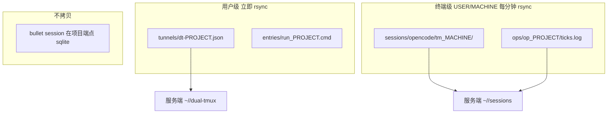

# dual-tmux 核心架构

本文替代租约 / handoff / generation 作为机制说明。实现按 [ROADMAP.md](../ROADMAP.md) 分六步迁过去。

## 目的

dual-tmux 方便续接工作点。一条隧道由两层 tmux 组成，名称 `dt-PROJECT`。

- trigger：靠近用户，一般在登录机终端，tmux 名 `op_PROJECT`。
- bullet：靠近项目，一般在服务器或容器，tmux 名 `run_PROJECT`。

独立模式只有一个用户终端，数据只在本地。服务模式可以有 N 个终端，需要一个服务端做备份和异地恢复。服务端不是分布式共识器。

## DST

DST（dual session tmux）= 两端都已启动 agent 会话，并且已经 freeze。agent 可以是 opencode、codex、claude。

DST 记录：

- `op_*` / `run_*` 名称
- trigger / bullet 的位置端点（本机、SSH、容器）
- agent runtime（tool / model）
- 两侧 `session_id`

未 freeze 的只是活着的 DT，不能当作跨机续接对象。

DST 允许变更。常见是 bullet 端点或 session 变了，偶尔 trigger 过长重开。变更后：

- `dt freeze` 覆盖当前 DST
- 或 `dt branch` / save-new 另存一条

`freeze` 是普通命令。用户新建隧道后可以发；trigger agent 在重建 trigger 或 bullet 的 oc 后也可以发。谁发都一样：记录此刻已经绑在这条隧道上的会话，不猜「最新 session」。

## 两层数据

`tm_*` 就是 MACHINE。同一 `user` 下可以有 `tm_ouc`、`tm_andy_home`。

bullet 会话不同步。另一台机器 resume 是重连同一个端点上的同一个 session id。

管理信息（dt / dst）变更立刻 rsync。任何一端 `resume` / `pull` 之前先把这一层拉到本地。

## 新鲜度：指纹 + tick

只看 trigger pane：

1. 最近 20 行
2. 去掉 ANSI
3. SHA-1
4. 和该 MACHINE 在 `op_*` 旁 tick 日志的最新一条比较
5. 指纹没变，不写新 tick；变了才追加

`resume` 一条或 `pull` 全部时，比较各 MACHINE 最后一次指纹变化，取较新的 trigger 数据。两台都空闲则比最后成功上传时间；再并列指定一台，不要 stall。

bullet pane 不算指纹。

## 独热

同一时刻只有一个活动 trigger。`resume` 就是声明：

1. 拉取用户级 DST
2. 按 tick 取较新 trigger 快照（S4 起；S1 先保证占用）
3. 覆盖写入服务端占用文件 `occupancy/<dt-name>.json` = 本机 `tm_*`
4. 本机若有「该退出」标记则清掉
5. 恢复 trigger、重连 bullet、attach

其他 MACHINE 的 daemon 看到占用者不是自己，把本机这条隧道的 tmux 退出，回到 shell，不要留在 tmux 里。

占用文件无 TTL。后写覆盖先写。旧端在线立刻退；旧端睡眠/离线，醒来再退。新端不为旧端能否 persist 而失败。

清退对象是旧终端上的本地 tmux。`run_*` 若只是本机 SSH 窗，可以一起拆。容器里的 bullet agent 必须留着。

Hub 不可达、锁屏、睡眠、占用暂时读不到，不得清退本地 tmux。

## 明确不采用

- 4 秒 lease / generation CAS 作为日常独热
- 等待旧端 handoff persist → park → commit
- 把「lease 还在续」当成「旧端还能交接」
- 日常路径去 fence 远端 bullet writer（物理故障再在服务端手工清）
- 整库 rsync OpenCode sqlite
- resume 时猜测或覆盖 session id

## 和现行代码的关系

S6 已落地：`OccupancyNode` 是独热事实。`resume` / Web 接管先拉 DST 与 persist，再写 occupancy。Hub 上的 handoff/fault/lease 脚本已删除。

S7：Tunnel 拥有 RoleBinding。S8：freeze / 重建 bullet 走 BindingAttempt（状态待确认，见 [datanode-fsm.md](datanode-fsm.md)）。
