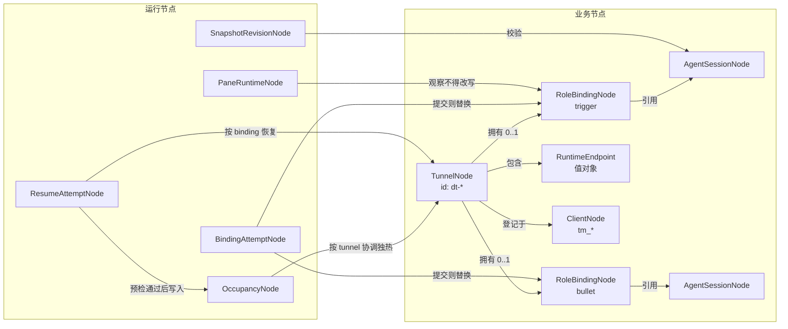

# DataNode + FSM 方向

本文把 dual-tmux 的下一阶段定成两件事：

1. **DataNode 是项目的领域支点。** CLI / Web / 飞书都只是对节点的薄入口。
2. **FSM 只约束“会改节点”的过程。** Guard 决定能不能迁，Hook 负责提交副作用。

独热机制已经落地：占用文件，不是租约。本文不再设计 Lease / Handoff / FaultTakeover。

状态/事件已确认。Graph/Machine 在 `datanode/runtime_fsm/binding.py`；`dt freeze` 经 `run_freeze_attempt` 发事件。

## 1. 节点前提

业务节点（停掉 tmux 也还要记住）：

| 节点 | 身份 | 职责 |
|---|---|---|
| `TunnelNode` | `dt-*` | 隧道聚合根。DST = 两端 RoleBinding 都在。 |
| `RoleBindingNode` | `tunnel + role` | 这个角色此刻绑定哪个 Agent 会话。 |
| `AgentSessionNode` | `tool + session_id` | Agent 原生可恢复会话，没有 role。 |
| `ClientNode` | `tm_*` | 用户能认出的机器端。占用 holder 就是它。 |

值对象：`RuntimeEndpoint`（bullet 工作位置）。`reconnect_command` 从位置派生，不是独立事实。

运行节点（可过期、可重建）：

| 节点 | 身份 | 职责 |
|---|---|---|
| `OccupancyNode` | `tunnel + generation` | 谁占用 trigger。无 TTL，后写覆盖。 |
| `PaneRuntimeNode` | `tunnel + role + observed_at` | 一次 pane 观察，不能改 binding。 |
| `SnapshotRevisionNode` | `session + digest` | 恢复/冲突判断用的内容身份。 |
| `BindingAttemptNode` | `attempt_id` | 一次 freeze 或 rebuild 过程。 |
| `ResumeAttemptNode` | 已有 shadow | 一次 resume：拉 DST → 选 tick → 预检 → 占用 → 恢复。 |

不做成节点：tmux pane 句柄、SSH 连接、daemon pid、4 秒租约、installation fence。



不变量（迁移前后始终成立）：

- 同一 Tunnel 同一 role 最多一个当前 binding。
- Trigger / Bullet 不得绑定同一 `session_id`。
- 未 freeze 的 Tunnel 合法；DST 只表示两端都已绑定。
- pane down、锁屏、Hub 不可达不得清空 binding，也不得清退本地 tmux。
- Occupancy 不能改 Tunnel / Session / Endpoint。
- rebuild 在新会话被证明之前，不得丢掉旧 binding。

持久化：Tunnel JSON + occupancy JSON + trigger persist/ticks。运行期资源（tmux、SSH）恢复时重建。

## 2. 哪些变化需要 FSM

| 变化 | 要不要 FSM | 原因 |
|---|---|---|
| `dt freeze` / agent freeze | 要 | 证明 live session → 提交 binding + endpoint |
| trigger 重建 bullet 会话 | 要 | 同一条 BindingAttempt，intent=`rebuild`；hook 刷新隧道参数 |
| `dt resume` | 已有 shadow | 拉数据失败必须 fail-closed，不能先占后拉 |
| occupancy claim | 不要长流程 | 一次覆盖写文件 |
| daemon 看到外人占用后 park | 不要 | 对 occupancy 的反应，不是过程节点 |
| tick 指纹 | 不要 | 观察追加，不是状态机 |

## 3. BindingAttempt 核心状态（待确认）

主体：`BindingAttemptNode`。一次只处理一个 role。

| 状态 | 含义 | 允许行为 | 进入 | 离开 | 终态/可恢复 |
|---|---|---|---|---|---|
| `created` | 已请求 freeze 或 rebuild | 采集 pane / 探测 session | 用户或 trigger 发出请求 | 开始证明 live session | 可恢复 |
| `proving` | 正在证明 live session 与 endpoint | 只读探测，不写 Tunnel | live 探测开始 | 证明成功或失败 | 可恢复；失败不改 binding |
| `committing` | 已有可提交候选，准备写节点 | 写 binding / endpoint / entry | guard 通过 | 持久化成功或失败 | 可恢复；失败回旧 binding |
| `bound` | 新 binding 已成为 Tunnel 事实 | 可 rsync DST | 持久化成功 | 无 | 成功终态 |
| `rejected` | guard 拒绝，未改业务节点 | 报告原因 | 占用不是自己、会话未证明、会话冲突 | 无 | 失败终态 |
| `failed` | 副作用失败，业务节点保持旧值 | 报告原因 | 写文件 / push 失败 | 无 | 失败终态 |

非法：从 `created` 直接到 `bound`；在 `proving` 清空旧 session_id；把 pane 观察写成 binding。

## 4. 核心事件（待确认）

| 事件 | 事实 | 发出者 | 载荷 | 可发生状态 | 重复语义 |
|---|---|---|---|---|---|
| `requested` | 用户或 trigger 要求 freeze/rebuild | CLI / trigger agent | tunnel, role, intent | 新 attempt | 新 attempt，不改旧 attempt |
| `live_session_proven` | 当前 pane 上证明了原生会话 | worker | session_id, tool, directory, endpoint | `created`/`proving` | 同一 session 幂等 |
| `live_session_missing` | 证明窗口内没有合法会话 | worker | error | `created`/`proving` | 保持失败，不猜历史会话 |
| `commit_succeeded` | Tunnel JSON / entry 已写下 | worker | binding snapshot | `committing` | 幂等成功 |
| `commit_failed` | 写节点或 push 失败 | worker | error | `committing` | 保持旧 binding |

## 5. 迁移矩阵（待确认）

| 当前 | 事件 | Guard | 下一状态 | 副作用 | 失败语义 |
|---|---|---|---|---|---|
| `created` | `live_session_proven` | 服务模式 occupancy holder 是本机；session ≠ 对端；bullet 的 endpoint 完整 | `committing` | 无（guard 无副作用） | 拒绝则 `rejected`，旧 binding 不动 |
| `created` | `live_session_missing` | 无 | `rejected` | 无 | 提示先 `dt enter/work --oc` |
| `committing` | `commit_succeeded` | candidate 仍等于 proven session | `bound` | Graph `on_enter` 只更新 BindingAttemptNode。Tunnel 提交在 worker hook `apply_proven_binding`（TunnelNode 往返；bullet 写 run entry）里，且必须发生在本事件之前 | hook 失败发 `commit_failed`，原 dict 不改 |
| `committing` | `commit_failed` | 无 | `failed` | 不回写半份 Tunnel | 旧 DST 仍可用 |
| 其他组合 | 任意 | — | 非法 | 状态不变 | — |

执行顺序固定：`guard → on_exit → 切状态 → on_enter`。

## 6. 钩子：重建 bullet 时刷新隧道参数

这是你举的场景，也是 BindingAttempt 存在的理由。

```text
trigger 重建 bullet 会话
  → BindingAttempt(intent=rebuild, role=bullet)
  → 在 working copy 上证明 live session / endpoint（不写原 Tunnel JSON、不写 entry）
  → guard: 占用是自己；新 session 已证明；≠ trigger session
  → worker hook apply_proven_binding:
       1. from_legacy_tunnel(working) 校验 TunnelNode
       2. 投影 RoleBinding + RuntimeEndpoint（reconnect_command）
       3. bullet 先 persist_run_entry，失败则原 dict 不动
       4. 再写回原 tunnel dict
  → send commit_succeeded；Graph on_enter 只更新 attempt 节点
  → freeze 入口再 stamp / save / 用户级 rsync
  → 旧 binding 只在 commit 成功后丢弃
```

Guard 拒绝时 Tunnel 保持旧 DST。这避免“会话已经换了，隧道还指着旧 id，resume 再修一次”。

`dt freeze` 走同一台机器，intent=`freeze`。覆盖当前 DST；另存新 DST 仍走 `branch`。

## 7. ResumeAttempt 保持原序

已确认、已实现的顺序不变：

1. 拉用户级 DST
2. 按 tick 选较新 trigger 快照
3. persist 预检 fail-closed
4. 写 Occupancy
5. 按 **binding 里的 session id 和 endpoint** 恢复 tmux

Resume 不猜测 session，不 union 快照。BindingAttempt 负责让那些字段在重建后就是对的。

## 8. 明确不做

- 把 Occupancy 做成带 TTL 的租约状态机
- ClientInstallation / fence / handoff persist
- pane 观察驱动自动换会话
- 一次性让 CLI 脱离 dict：先 shadow 校验 BindingAttempt，再让 ControlService 发事件

已实现：`BindingMachine.send()` 是 freeze/rebuild 的唯一状态入口。`_freeze_one` 先证明再提交；失败回滚旧 binding。外人占用时不跑探测、不改 Tunnel。
