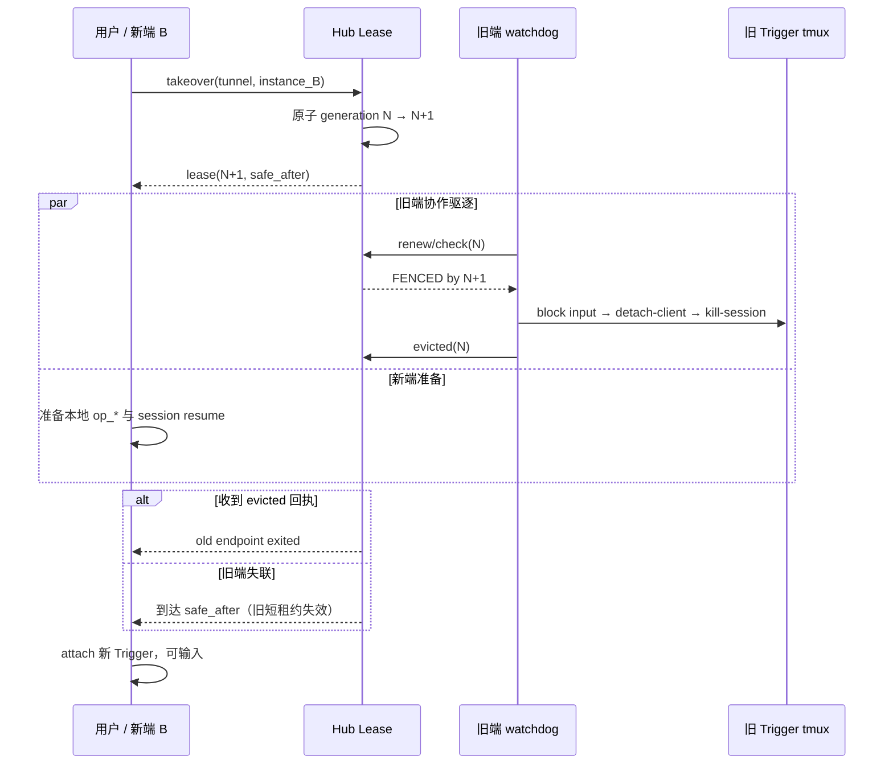

# Trigger 独热控制与终端驱逐契约

> 状态：目标架构契约；在 v0.4.55 实现，在 v0.4.56 完成真实双端验收。
> 适用范围：Hub 模式下同一个 tunnel 的多 Client 使用。local-only 只保证单机内互斥，不宣称跨机器独热。

## 1. 用户体验契约

同一个 tunnel 可以在多个 Client 上被观察和接续，但只能有一个活动控制端。

必须同时满足：

1. 用户在新端明确发起“接管”后，不需要旧端确认；在 Hub 可达、系统健康的条件下，新 Trigger 从接管请求到可输入不得超过 **10 秒**。
2. 被取代的旧 Trigger 必须退出对应的 tmux：先停止接受输入，再 detach attached client，并终止旧 `op_*` session，使前台 `tmux attach` 返回到用户进入前的 shell 页面。不得只显示“无 owner”却继续留在 tmux 中。
3. Web、CLI 和 Feishu 在同一 Client 上是不同入口，不互相抢占；它们共享该 Client 的 tunnel owner，由 operation lock 处理进程间竞争。
4. 只读观察不获取控制权。打开 Web 页面、读取 pane、health 或 owner 不得踢走当前 Trigger。

## 2. 独热的精确定义

Hub 是 ownership 的唯一仲裁者。每次租约至少包含：

```text
tunnel_id + client_id + instance_id + generation + expires_at
```

- `client_id` 表示使用端，例如 `tm_macbook`。
- `instance_id` 区分同一 Client 上不同 daemon 生命周期。
- `generation` 是单调递增的 fencing token。
- `expires_at` 使用 Hub 时钟计算，避免 Client 时钟漂移决定所有权。

“活动”不是“本地存在 tmux 文件或进程”，而是：该端持有 Hub 当前 generation，并且本地 watchdog 仍确认租约有效。旧 generation 即使进程尚未退出，也不再具有提交操作或状态的权限。

ownership 以整个 tunnel 为作用域。Trigger、Bullet 和相关恢复动作使用同一个 generation，避免 Trigger 在 A 端、Bullet 操作却从 B 端进入的 split-brain。

## 3. 接管时序与时间预算



建议默认时间参数：

| 项目 | 目标 |
|---|---:|
| watchdog heartbeat/check | 2 秒 |
| tunnel lease TTL | 6 秒 |
| 在线旧端停止接受输入 | ≤ 2 秒 |
| 在线旧端 detach + kill 完成 | ≤ 5 秒 |
| 旧端失联时安全失效等待 | ≤ 6 秒 + 小幅安全余量 |
| 新端接管到 Trigger 可输入 | **≤ 10 秒** |

接管路径不得等待旧端人工确认，也不得等待历史的 300 秒 lock TTL。新端可以与安全等待并行准备 session，但只能在旧端驱逐回执或 `safe_after` 到达后开放输入。

10 秒门槛衡量的是 dual-tmux 可控制的接管链路。在 Hub 不可达、Agent 二进制损坏或外部 SSH 完全不可用时必须 fail-closed，并在 10 秒内返回明确失败，不能虚报已取得控制权。

## 4. 旧端终端行为

watchdog 发现 generation 失效后按以下顺序执行：

1. 将本地 tunnel 标记为 `FENCED`，所有 CLI/Web/Feishu 写操作立即拒绝。
2. 禁止 auto-recovery 和自动 resume 重新拉起该 Trigger。
3. 对 `op_*` 执行 `tmux detach-client -s <op>`。
4. 对同一个 `op_*` 执行 `tmux kill-session -t <op>`；detach 失败时 kill 是兜底。
5. 验证 session 不存在，并记录 `owner.fenced`、旧/新 generation、驱逐原因和耗时。
6. 前台 `dt enter` / `tmux attach` 返回原 shell；可打印一次“控制权已转移到 <client>，旧 Trigger 已退出”。
7. 清理旧端的本地 `run_*` transport，防止它继续驱动同一 Bullet；不得删除 tunnel binding、session ID、memory 或 persist 数据。

“踢出”明确指退出 tmux attach 并回到 shell，不是切换到另一个 tmux session，也不是仅把页面改成只读。

## 5. 所有写操作必须 fencing

以下入口都必须在副作用前验证当前 generation：

- Trigger/Bullet `send`
- `enter/work/reconnect`
- `freeze/resume/model`
- `drop/remove`
- health recovery 与 auto recovery
- Hub push/pull 中涉及该 tunnel 的提交
- daemon、cron、Web 和 Feishu 发起的同类操作

操作执行时间超过一次 heartbeat 时，在不可逆 commit point 前再次验证 generation。旧 generation 返回稳定的 `ownership_lost`，不得继续写文件、send-keys、恢复 Agent 或覆盖新 owner 状态。

直接打开旧 tmux 的路径也必须由 watchdog 约束；不能只依赖 HTTP/CLI handler 检查，因为用户可以在已附着 pane 中直接输入。

## 6. 断网、暂停与崩溃

- 旧 Client 无法续租时，最迟在本地记录的租约截止点自我 fencing；不能因 Hub 查询失败而无限 fail-open。
- Client 睡眠/恢复、daemon 重启或网络恢复后，必须先重新验证 generation，验证前不得恢复输入。
- 新端接管采用 Hub 原子 CAS；同一 generation 只能签发给一个 `instance_id`。
- 接管请求重复提交必须幂等，不重复递增 generation 或重复启动 Trigger。
- 旧端驱逐失败不允许静默；新端只可在收到驱逐回执或越过 Hub 给出的安全失效点后开放输入。

## 7. 验收矩阵

| ID | 场景 | 必须结果 |
|---|---|---|
| HOT-01 | A 活跃，B 显式接管 | B ≤10 秒可输入；A ≤5 秒回到原 shell |
| HOT-02 | A 网络断开，B 接管 | B 不等 300 秒；到 `safe_after` 后 ≤10 秒可输入 |
| HOT-03 | A 使用旧 generation 发送 | 返回 `ownership_lost`，pane 和数据均无副作用 |
| HOT-04 | A 被驱逐后 auto-recovery tick | 不得重建 `op_*` 或重新 attach |
| HOT-05 | 同一 Client 的 CLI 与 Web 并发 | 不互踢；写操作由 scoped operation lock 串行化 |
| HOT-06 | 两个新端同时接管 | Hub 只签发一个当前 generation，失败端保持 standby |
| HOT-07 | 接管请求重放 | generation 和 Trigger 实例各只产生一次 |
| HOT-08 | detach 失败 | kill-session 兜底，前台 attach 仍退出；记录失败阶段 |
| HOT-09 | 只读 Web 多端打开 | owner 不变化，不触发驱逐 |
| HOT-10 | Hub 不可达 | 10 秒内明确失败；新旧端都不得被宣告为新 active |

发布验收必须包含两个独立 `DUAL_TMUX_HOME`、两个真实 tmux client 和真实前台 attach，不得只用 mock 证明“调用过 detach”。
