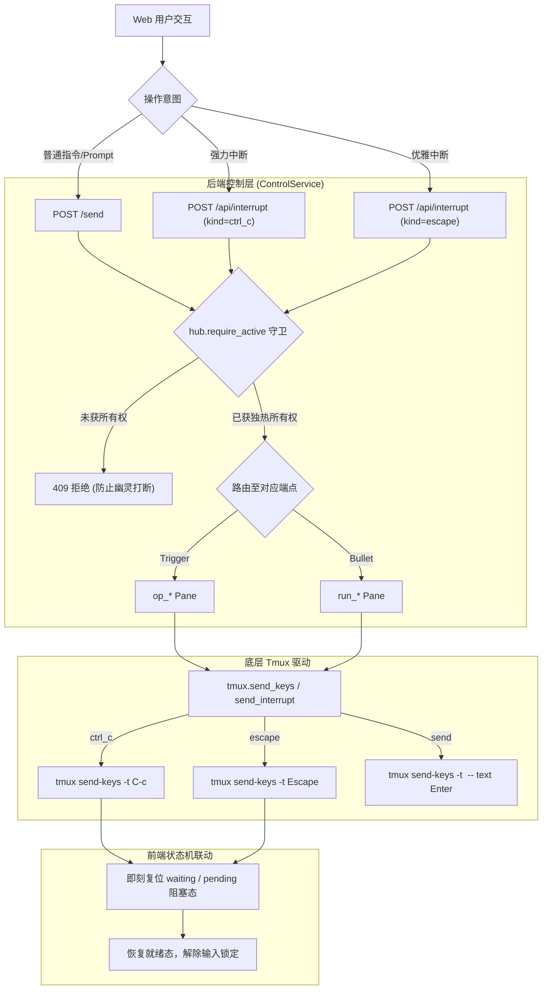

# Web 控制台现代化架构与组件控制规范

> 当前版本：v0.4.73  
> 核心模块：`src/dual_tmux/web_ui/`、`web_pages.py`、`control.py`、`tmux.py`  
> 预览沙盒：`http://127.0.0.1:8787/components?c=<comp_id>`

---

## 1. 架构定位：Web 与 CLI 的关系

在 dual-tmux 体系中，**CLI 是严肃运维与自动化脚本的原子事实**，而 **Web 控制台是面向多隧道协同的“全景监视器与交互视窗”**：

- **单隧道专注（CLI）**：适合物理终端上单点深入（如 `dt enter` / `dt work` 附着操作），但不便于同时监视十几个并发项目的 Agent 推理进度。
- **多隧道漫游（Web）**：在同一浏览器视窗中聚合全部隧道的 Trigger（op_*）与 Bullet（run_*）视窗，支持毫秒级会话切换、指令注入与状态轮询，无需频繁 attach/detach tmux。
- **业务中枢统一（ControlService）**：CLI 动词与 Web API 完全共享底层的 `ControlService` 与 DataNode 领域事实，Web 绝不绕过后端控制层直接裸读或乱改磁盘状态。

---

## 2. 输入控制流与打断机制（Input & Interrupt Stream Model）

### 2.1 第一性原理

无论是向会话发送 Prompt 还是向进程发送中断信号（Ctrl+C / Escape），在第一性原理上都属于**“对目标端点（Trigger / Bullet）的输入流注入（Input Injection）”**：



### 2.2 两类打断语义

1. **强力中断（SIGINT / `Ctrl+C`）**：
   - 底层调用 `tmux.send_interrupt(pane, key="C-c")`；
   - 作用：向目标窗格直接发送中断信号，强行终止死循环命令、耗时构建脚本或失去响应的前台进程。
2. **优雅中断（Agent Interrupt / `Escape`）**：
   - 底层调用 `tmux.send_interrupt(pane, key="Escape")`；
   - 作用：OpenCode 等 TUI Agent 在深度思考或执行长工具调用时，按 Escape 可以优雅中止本轮回答，保留当前上下文与历史记录。

### 2.3 独热守卫与状态解锁

- **安全守卫（Fencing Guard）**：所有中断操作必须经由 `hub.require_active(data)` 校验，未持有独热所有权的端点禁止打断，避免多端协作下的幽灵击键。
- **状态机即刻解锁**：前端发出中断请求并返回成功后，前端立即清除 `st.waiting = false` 与 `st.pending = null`，恢复就绪指示灯，并在控制日志中记录 `🛑 [系统] 已向目标端点发送中断信号`。

---

## 3. 双端终端视窗规范（DualTerminal View & Scrollback）

### 3.1 3000 行历史深度与平滑回溯

- **捕获深度**：后端 `_capture(name)` 提升至 `-3000` 行，满足长输出日志（构建编译、大模型分块输出）的完整回溯。
- **Tmux Buffer**：底层 `ensure_session` 默认分配 `history-limit 10000` 行缓冲池。
- **视窗高度**：视窗高度调整为 580px（最大 75vh），保证大屏工作下的信息视野。

### 3.2 滚动条常驻与内容同步机制

在 macOS 系统下，默认的系统行为是在不滚动时自动隐藏滚动条，导致用户产生“没有滚动条”或“视窗已被截断”的困惑。本次改造确立了以下规范：

1. **显式深色半透明 WebKit 滚动条**：
   ```css
   .dt-pane-screen::-webkit-scrollbar { width: 8px; height: 8px; }
   .dt-pane-screen::-webkit-scrollbar-track { background: #090d16; }
   .dt-pane-screen::-webkit-scrollbar-thumb { background: rgba(148, 163, 184, 0.28); border-radius: 4px; }
   .dt-pane-screen::-webkit-scrollbar-thumb:hover { background: rgba(148, 163, 184, 0.55); }
   ```
   只要文本高度超过视窗，滚动条滑块始终清晰可见。
2. **切换会话即刻重置与吸底**：
   当用户切换 Tab 会话时，`DualTerminalComponent` 立即重置 `lastContent = ''` 与 `isAtBottom = true`，确保新会话内容注入后立即计算滚动位置并自动吸底，杜绝旧会话位置残留。
3. **智能滚动吸底胶囊（Scroll-Lock Banner）**：
   当用户向上滚动查看历史时，视窗右下角弹出 `👇 滚动锁定中 · 点击回到底部` 胶囊；DOM 内容更新时受 `isUpdating` 防抖守卫保护，不会因纯文本注入触发虚假滚动事件。

### 3.3 底部呼吸留白设计

为解决页面底部贴屏导致用户无法确认“是否已经到底”的问题：
- 页面底部容器增加了 `padding-bottom: 72px` 呼吸空白；
- 双端视窗末端增加了居中边界标记：`· dual-tmux 会话视窗到底 · 已预留底部操作空白 ·`。

---

## 4. Web 组件化演进与沙盒驱动体系

项目采用**独立组件库 + 沙盒预览 + 逐级替换**的演进路径，避免一次性重写导致生产功能退化：

| 组件名称 | 职责 | 现行状态 | 沙盒测试地址 |
|---|---|---|---|
| **DualTerminalComponent** | 双端终端视窗（分屏/独占/吸底/复制/深色滚动条） | **已上线生产** (v0.4.70) | `/components?c=terminal` |
| **CommandSenderComponent** | 指令发送器（目标切换/换行快捷键/打断Ctrl+C/中断Esc） | **已上线生产** (v0.4.73) | `/components?c=sender` |
| **TunnelPickerComponent** | 隧道选择与 Tabs（高亮活跃会话/FocusCard端点映射） | **沙盒验证就绪** (v0.4.71) | `/components?c=picker` |
| **OccupancyCardComponent** | 独热仲裁与接管控制卡片 | **沙盒验证就绪** | `/components?c=occupancy` |
| **TurnThreadComponent** | Agent 问答流气泡展示卡片 | **沙盒验证就绪** | `/components?c=thread` |
| **LifecycleToolbarComponent** | 隧道运维工具箱（冻结/恢复/换模型/Drop） | **沙盒验证就绪** | `/components?c=lifecycle` |
| **DualToast** | 全局轻量化反馈通知系统 | **已全站生效** | `/components?c=toast` |

---

## 5. 开发与发布标准流程

每次对组件或 Web 机制的修改必须遵循以下质量门禁：

1. **建立特性分支**：`git checkout -b feature/xxx`；
2. **组件与后端双向对齐**：修改前端 JS/CSS 的同时，完善后端 Control API 与 tmux 驱动；
3. **全量测试门禁**：执行 `uv run pytest` 确保所有测试 100% 通过（目前基线 467 项）；
4. **版本递增与打包构建**：在 `pyproject.toml` 与 `__init__.py` 中递增版本，执行 `uv build && uv tool install --force dist/*.whl`；
5. **本地热重启验证**：向 `dt_web_server` 发送信号重启并验证页面表现；
6. **PR 审核与 Squash 合并**：通过 `gh pr create` 发起 PR 并使用 `gh pr merge --squash --delete-branch` 合并回主线。

